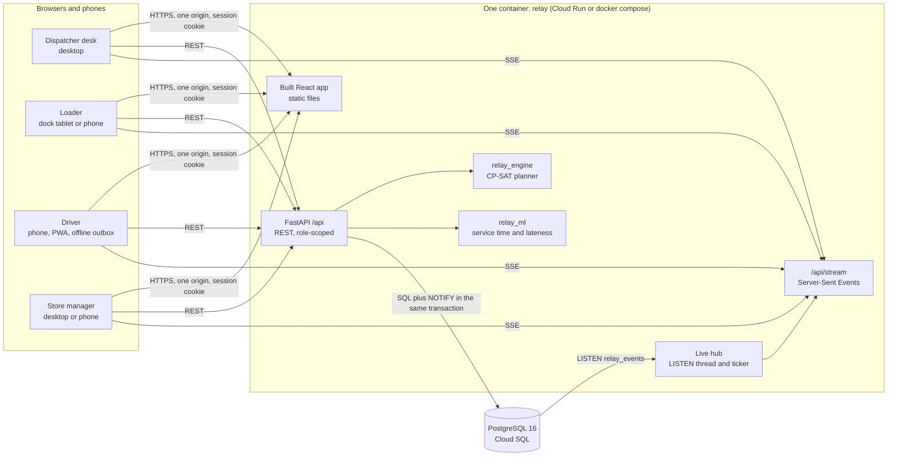
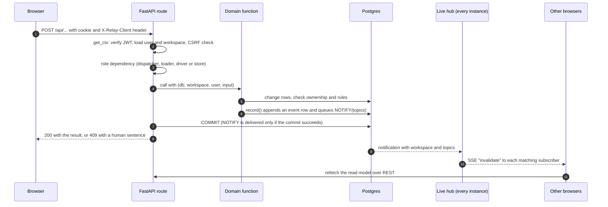
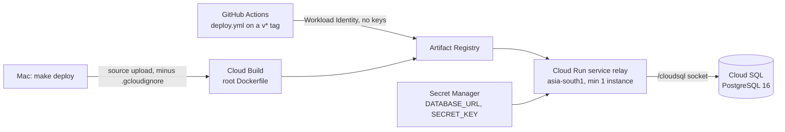

# Architecture

Relay is **one plan, four faces**. A dispatcher plans tomorrow's deliveries under real limits, a loader loads each
truck in reverse stop order, a driver records every stop (with or without signal), and a store manager orders and
confirms what arrived. All four work on the same plan, and every change reaches the people it affects within a
couple of seconds.

This page explains how the pieces fit. The details live in:

- [PLANNING_ENGINE.md](./PLANNING_ENGINE.md): the CP-SAT planner, policies, explanations, validation.
- [OFFLINE_SYNC.md](./OFFLINE_SYNC.md): the outbox, idempotent sync, dark vans, "physical facts win".
- [DATA_MODEL.md](./DATA_MODEL.md): tables, lifecycles, the event log, seed data.

## 1. The system on one page

**Why one service.** One origin means the session cookie needs no CORS rules, Server-Sent Events work everywhere,
and judges get a single URL. The planner and the predictor are Python packages imported in-process, so there is no
network hop between "plan" and "save". Postgres is the only state: the event log, the live notifications
(`LISTEN/NOTIFY`), the per-workspace virtual clock and the media (delivery and dock photos) all live there. A container
can be killed at any moment and another one carries on.

**What runs where.**

| Piece | Code | Notes |
|---|---|---|
| Web app | `apps/web` (React 19, TypeScript, Vite, React Query, Dexie, PWA) | Built once into `apps/web/dist`; FastAPI serves it. Each role is a lazy chunk with its own CSS. |
| API | `apps/api/relay_api` (FastAPI, SQLAlchemy 2, psycopg 3, Alembic, Pydantic 2) | Sync route handlers run in the threadpool. One uvicorn worker per container. |
| Planner | `packages/engine/relay_engine` (OR-Tools CP-SAT) | Pure Python, no database or web imports. Also runs the Datathon Task 2B day from the command line. |
| Predictor | `packages/ml/relay_ml` (LightGBM, heuristic fallback) | Predicts service minutes and the chance of arriving after the window for each planned stop. |
| Database | PostgreSQL 16 | Local: `docker compose up -d db` on port 5433. Cloud: Cloud SQL over the `/cloudsql` socket. |

## 2. Request lifecycle

1. **Authentication.** Sign-in (`POST /api/auth/login`) checks an scrypt password hash and sets an httpOnly,
   SameSite=Lax cookie holding a signed JWT (`security.py`). The token carries the user id, role and workspace.
   Production sets `COOKIE_SECURE=true` and refuses to start with the development `SECRET_KEY`.
2. **CSRF.** Every write needs the header `X-Relay-Client: web` (`deps.csrf_guard`). A cross-site form can send the
   cookie but cannot set a custom header.
3. **Scope.** Route dependencies `dispatcher`, `loader`, `driver` and `store` (`deps.py`) enforce the role, and the
   domain functions check ownership: a driver touches only its vehicle's trips, a loader only its depot's, a store
   only its outlet's orders. The UI never decides access. `e2e/tests/smoke.spec.ts` and
   `apps/api/tests/test_security.py` prove it with wrong-role requests.
4. **Domain.** Business rules live in `domain/` as plain functions: `planning.py`, `fieldops.py`, `ordering.py`.
   Refusals raise `PlanningError`, `FieldError` or `OrderingError` with a sentence a person can act on, mapped to 409.
5. **Event log.** Every write calls `record()` (`domain/events.py`), which appends an `event` row and queues a
   Postgres `NOTIFY` in the same transaction. Notices for a person's feed go through `post_notice()`.
6. **Read models.** Each face reads one shaped payload from `domain/views.py`: `dispatch_snapshot`, `dock_queue` and
   `dock_trip`, `driver_run`, `store_home`. The browser never assembles state from raw tables.

## 3. Live updates

- **Server.** One listener thread per process holds a dedicated connection and `LISTEN`s on `relay_events`
  (`realtime.py`). Each open `GET /api/stream` registers its workspace and its interests: the dispatcher hears
  everything; the others hear `plan`, `clock` and their own scope (`depot:<name>`, `vehicle:<id>` or
  `outlet:<id>`). Bursts are coalesced for 250 ms (publishing a plan touches many topics), and an idle stream gets a
  `clock` event every 15 seconds.
- **Browser.** `useLive(keys)` (`apps/web/src/lib/live.ts`) turns `invalidate` events into React Query refetches.
  If the stream drops, the browser reconnects after 3 seconds and the queries fall back to polling.
- **Many instances.** Because the fan-out goes through Postgres, every Cloud Run instance hears every change. No
  sticky sessions, no Redis.
- **The rest of the network.** Only a few vehicles have a person signed in. While anyone watches a workspace, a
  ticker in the stream advances the trips nobody drives along the virtual clock (`domain/simulate.py`) and marks a
  person-driven van dark when its phone has been silent for `HEARTBEAT_DARK_S`. A Postgres advisory lock per
  workspace makes sure only one instance simulates it.

### Who hears what

The dispatcher subscribes to every topic, so the table lists the other faces.

| Event | Raised by | Topics | Loader | Driver | Store |
|---|---|---|---|---|---|
| `order.placed` | store | `outlet:<id>`, `orders` | | | own outlet |
| `orders.closed` | dispatcher | `plan`, `outlet:*` | ✓ | ✓ | ✓ |
| `plan.drafted`, `plan.published` | dispatcher | `plan` | ✓ | ✓ | ✓ |
| `order.moved`, `order.deferred` | dispatcher | `plan`, `vehicle:<id>`, `outlet:<id>` (+ `depot:<name>` for a move) | ✓ | ✓ | ✓ |
| `move.queued` (van is dark) | dispatcher | `vehicle:<from>`, `vehicle:<to>` | | both vans | |
| `order.split_requested` | dispatcher | `outlet:<id>` | | | own outlet |
| `line.checked` | loader | `depot:<name>` | own depot | | |
| `line.flagged` (short at the dock) | loader | `depot:<name>`, `vehicle:<id>` | own depot | own van | |
| `issue.decided` | dispatcher | `depot:<name>`, `vehicle:<id>`, `outlet:<id>` | ✓ | ✓ | ✓ |
| `trip.released` | loader | `depot`, `vehicle`, `plan`, each stop's `outlet` | ✓ | ✓ | ✓ |
| `run.started`, `stop.completed` | driver | `vehicle:<id>`, `plan`, the stop's `outlet` | ✓ (plan) | ✓ | ✓ |
| `stop.arrived` | driver | `vehicle:<id>`, `outlet:<id>` | | ✓ | own outlet |
| `driver.report` | driver | `vehicle:<id>` | | ✓ | |
| `receipt.confirmed` | store | `outlet:<id>`, `plan` | ✓ (plan) | ✓ (plan) | ✓ |
| `dock.change.acked` | loader | `depot:<name>` | own depot | | |
| `clock.changed` | dispatcher (demo) | `clock`, `plan` | ✓ | ✓ | ✓ |

`post_notice()` also notifies the audience it writes to (`dispatch`, `depot:<name>`, `vehicle:<id>`,
`outlet:<id>`), so a notice appears on the right screen even when no other row changed.

## 4. Offline-first field work

The driver and the loader record facts through a local **outbox** (IndexedDB via Dexie,
`apps/web/src/lib/offline/`). Every record gets a `client_event_id` and the device's time, the screen shows it at
once (an overlay of pending records on the last server copy), and `flush()` sends batches to `POST /api/sync`
whenever there is a connection. The server applies each event in a savepoint, answers `applied`, `duplicate` or
`rejected` per event, and never applies the same id twice. A dispatcher change aimed at a van with no signal is
queued, and a delivery the phone recorded meanwhile wins the conflict. The full story, with diagrams, is in
[OFFLINE_SYNC.md](./OFFLINE_SYNC.md).

## 5. Time: the virtual clock

Each workspace has its own clock (`domain/clock.py`): a real anchor, a virtual anchor, a rate and a paused flag. The
demo starts paused on Tuesday 29 September at 15:20, forty minutes before the 4 PM ordering cutoff for Wednesday.
Actions move it forward the way the real day would: the first dock check jumps to 75 minutes before departure, the
release to 10 minutes before, the run start to the departure, and the driver's records to the times on the phone.
The dispatcher's demo menu can also add 15 minutes or let it run. All business code uses `now_virtual(ws)`;
engine minutes are relative to the service date's midnight.

## 6. Workspaces and sandboxes

Every operational row carries `workspace_id`. The shared demo is `main`; anyone can start a **private sandbox**
from the sign-in page and sign in to all four roles with its code, so judges never collide. "Reset demo" rebuilds a
workspace from the seed in a few seconds. The e2e suite runs in its own sandbox, so it is safe to point at
production.

## 7. Deployment

The image is built in two stages (Node builds the web app; Python 3.12 slim runs it). On start the container runs
`alembic upgrade head`, seeds whatever is missing, then starts uvicorn; migrations and seeding each hold a Postgres
advisory lock, so several instances can start at once. `GET /api/health` reports the database, the seed, the
predictor in use and the revision. Step by step: [DEPLOY_GCP.md](./DEPLOY_GCP.md).

## 8. Quality gates

| Gate | What it proves | Where |
|---|---|---|
| Ruff, ESLint, Prettier, `tsc --noEmit` | style and types | `make lint`, `make typecheck`, CI `python` and `web` jobs |
| Engine unit tests | the booklet's trip-time formula, every rule in the validator, feasibility under all three policies, explanations, human move refusals, capacity rounding, pinned trips | `packages/engine/tests` |
| Predictor tests | heuristic fallback, trained boosters when present | `packages/ml/tests` |
| API tests (real Postgres) | the full walkthrough over HTTP, idempotent sync and device times, physical facts win, security and scopes, ordering cutoff | `apps/api/tests` |
| `make check-plan` | the demo day planned under every policy passes our port of the organisers' checker | CI `python` job |
| Playwright | the four-role walkthrough in real browsers, including a dark van and a damaged-case receipt; smoke and access tests | `e2e/`, CI `e2e` job |
| Docker Compose | a fresh clone starts with `docker compose up` and passes the smoke tests | CI `compose` job |

## 9. Decisions and trade-offs

| Decision | Why | Cost we accept |
|---|---|---|
| One FastAPI service serving API, SSE and SPA | Same-origin cookies, simple deploy, one URL | Web and API deploy together |
| Postgres `LISTEN/NOTIFY` for live updates | No extra infrastructure; works across instances | Notifications are signals, not a replayable log; clients refetch |
| SSE instead of WebSockets | One-way invalidation is all we need; plain HTTP through Cloud Run | 60-minute request limit on Cloud Run; browsers reconnect |
| REST read models per face | Each screen loads one payload; server stays the source of truth | Some refetching after each change |
| CP-SAT with a time limit plus an explanation pass | Optimal or near-optimal plans in seconds, and every deferral explained | Plans can differ slightly between runs |
| Outbox and idempotent sync instead of a sync framework | Small, testable, works with any backend | Conflict rules are hand-written (and documented) |
| Dispatcher desk kept as the approved vanilla-JS prototype | Pixel fidelity to the design that was judged | Two UI styles in one codebase |
| Virtual clock per workspace | A full delivery day can be demonstrated in minutes, and sandboxes do not interfere | All business code must use `now_virtual()` |
