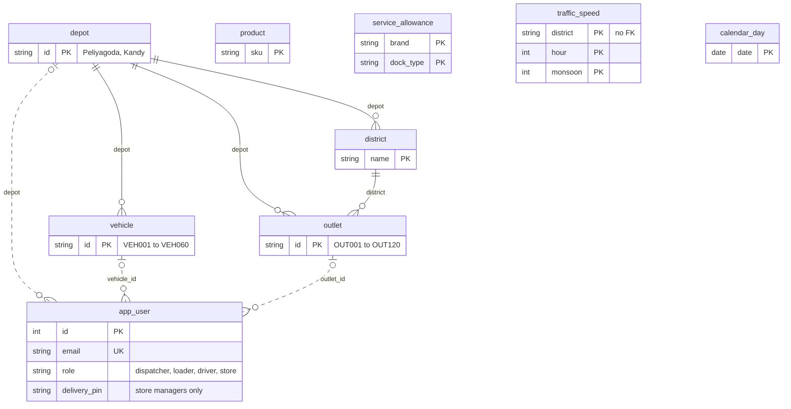
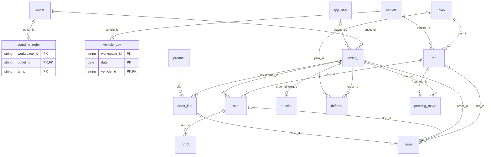
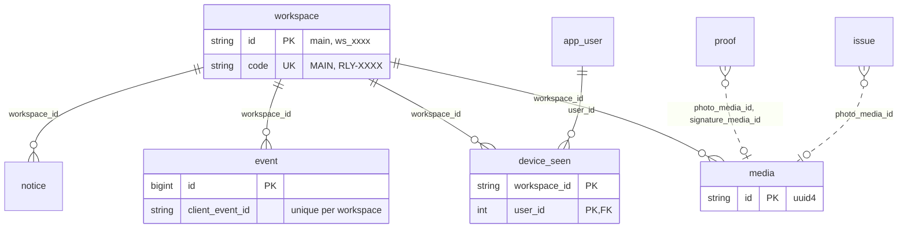
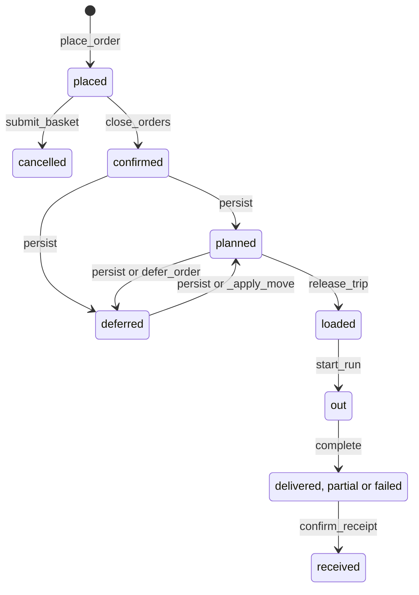
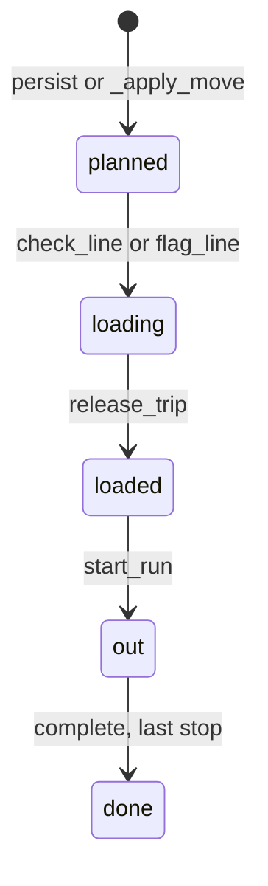
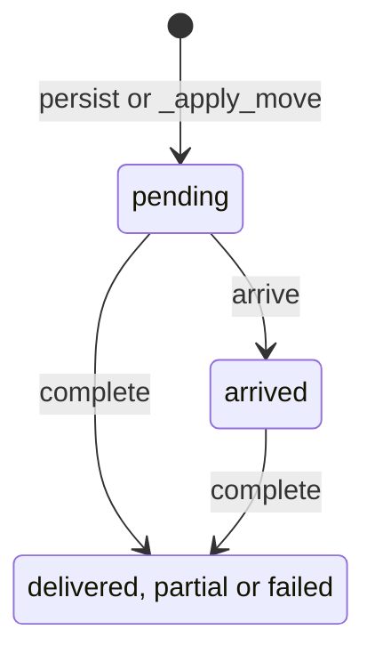
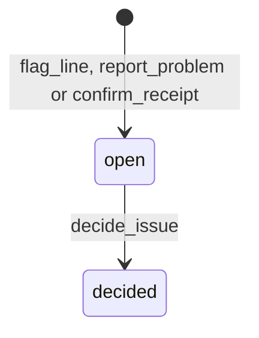
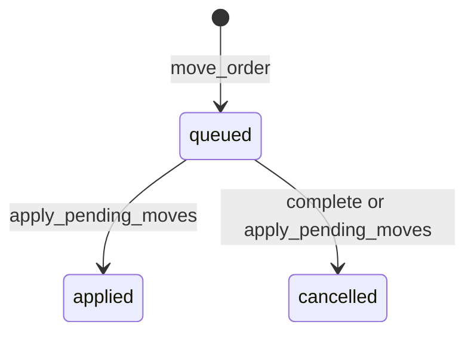

# Data model

Relay stores Waypoint's delivery day in one PostgreSQL database. It has 26 tables, defined as SQLAlchemy 2 models in `apps/api/relay_api/models.py` and created by two Alembic migrations. Short paths such as `domain/planning.py` are under `apps/api/relay_api/`; other paths are from the repository root. Functions are named together with their file, so each statement can be checked against the code.

## 1. Overview

- **Workspaces.** A workspace is one copy of the demo day. `main` (code `MAIN`) is the shared demo. Sandboxes (`sandbox = true`, id `ws_xxxx`, code `RLY-XXXX`) are private copies created by `POST /api/demo/sandboxes` (`routers/demo.py`). When `MAX_SANDBOXES` (default 50) is reached, the oldest sandbox is wiped and deleted.
- **10 global tables.** These are the reference data (`depot`, `district`, `outlet`, `vehicle`, `service_allowance`, `calendar_day`, `traffic_speed`, `product`), the accounts (`app_user`) and `workspace` itself. They have no `workspace_id`. The API reads the reference tables through `RefCache` (`domain/eta.py`), which loads them once per process. Nothing changes them at runtime.
- **16 workspace tables.** Everything operational. Each has `workspace_id` → `workspace.id` with `ON DELETE CASCADE`. The one exception is `order_line`, which belongs to its order through `order_id` (also cascading).
- **Accounts are shared by all workspaces.** Sign-in takes an optional workspace code, and an empty code means `main`. The session token stores the workspace id as the claim `ws` (`make_token`, `security.py`). Each request turns that claim into `ctx.ws` (`get_ctx`, `deps.py`), and read models and list queries filter on it.
- **Create, wipe, reset.** `create_workspace()` (`seed/__init__.py`) seeds a fresh demo day, wiping the workspace first if it already exists. `wipe_workspace()` deletes the workspace's rows table by table and leaves the `workspace` row and the global tables alone. "Reset demo" (`POST /api/demo/reset`, `make reset-demo`) calls `create_workspace()` on the same id.
- **Keys and defaults.** Surrogate keys are serial integers, numbered across all workspaces. `media.id` is a UUID string. Order references such as `WP-30401` are unique within a workspace. Column defaults are SQLAlchemy `default=` values. The only server default is `proof.pin_verified` (false, from migration `0002`), so a raw SQL insert must supply every other `NOT NULL` column.

To inspect a local database, run `docker compose exec db psql -U relay -d relay`.

## 2. Entity-relationship diagrams

How to read the diagrams:

- An edge label names the foreign-key column.
- A table's primary key is `id` unless its box shows another one.
- A dotted edge is a reference the code relies on but that has no foreign key.

Columns are listed in section 3.

### 2.1 Reference data and accounts (global)



### 2.2 Planning and execution (workspace tables)

Every table in this diagram except `order_line` also has `workspace_id`. Those edges are left out to keep the diagram readable. `order_.origin_order_id` points from a carried-over order back to the original order.



### 2.3 Workspace, notices and the event log



## 3. Tables

### 3.1 Global tables

| Table | Rows | Source | Key columns and notes |
|---|---|---|---|
| `depot` | 2 | `seed_reference()` | `Peliyagoda` (PEL, 3 docks) and `Kandy` (KDY, 1 dock), with `bays_per_dock` 5 |
| `district` | 12 | `district_travel.csv` | `depot`, `d2d_min`, `d2d_km`, `inter_min`, `inter_km` (the CSV's depot-to-district and inter-stop columns) |
| `outlet` | 120 | `outlets.csv` | `brand`, `district`, `depot`, `dock_type`, `parking`, `mall_window`, `window_open`, `window_close`. Names and managers are fictional, from `seed/names.py`. `usual_vehicle_ambient` and `usual_vehicle_chilled` come from `data/demo/outlet_profiles.json` plus `USUAL_OVERRIDES`. |
| `vehicle` | 60 | `vehicles.csv` | `type`, `temp`, `weight_cap_kg`, `volume_cap_m3`, `km_per_l`, `weekly_fuel_quota_l`, `depot`, `driver_name` |
| `service_allowance` | 9 | `service_allowance.csv` | handling `minutes` per (brand, dock_type) |
| `calendar_day` | 910 | `calendar.csv` | `dow_name` and `is_weekend` are not stored. The API does not read this table at runtime. |
| `traffic_speed` | 576 | `traffic_speed.csv` | `speed_index` per (district, hour, monsoon); an ML feature in `predict_trip` (`domain/eta.py`) |
| `product` | 11 | `seed/catalog.py` | `brand`, `temp`, `unit_kg`, `unit_m3`, `uom`; the team's catalogue, with unit sizes taken from the medians in the history |
| `app_user` | 6 | `USERS`, `seed/__init__.py` | `role`, scope (`depot`, `dock`, `vehicle_id`, `outlet_id`), scrypt `password_hash`, and for store managers `delivery_pin` (4 to 6 digits from `STORE_PINS`; `seed_users()` also fills it in for an account seeded before it existed). Only `lang` changes at runtime (`PATCH /api/auth/me`). |
| `workspace` | 1 + sandboxes | `create_workspace()` | `service_date`, `orders_closed_at` (set by `close_orders`), `sandbox`, and the clock columns described in section 6 |

### 3.2 Workspace tables

Functions are in `domain/` unless a router is named.

| Table | Purpose | Key columns | Written by |
|---|---|---|---|
| `vehicle_day` | Each vehicle's state on the service date | `status`, `fuel_used_l` (used this week before this day), `back_on` | the seed only. `build_problem` (`planning.py`) reads it. |
| `standing_order` | A store's usual basket, placed at the cutoff | `lines` JSON `[[sku, qty], ...]` | the seed; `submit_basket` (`ordering.py`) saves the latest basket; `close_orders` places it |
| `order_` | One outlet, one temperature, one service date | `ref`, `status`, `channel`, `deferred_yesterday`, `days_since_served`, `deferral_streak`, `origin_order_id` | `place_order` (`ordering.py`), the seed; status changes are in section 4 |
| `order_line` | One SKU line, from ordered to loaded, delivered and received | `qty`, `load_state`, `loaded_qty`, `loaded_by`, `delivered_qty`, `received_qty`, `receipt_issue` | created with its order; `fieldops.py` (dock, delivery, receipt); `advance` (`simulate.py`) |
| `plan` | One solve of one service date | `version`, `policy`, `status`; JSON `kpis`, `solver`, `lever_cache` | `persist`, `publish`, `lever` (`planning.py`) |
| `trip` | One vehicle trip (`trip_no` 1 or 2) | `code`, `status`, `planned_depart`, `dock`, `bay`, `controlled`, `signal`, `locked`, `seal_no`, `release_temp_c` | `persist`, `_apply_move`, `retimetable` (`planning.py`); `fieldops.py`; `simulate.py`; lock toggle in `routers/dispatch.py` |
| `stop` | One order on one trip | `seq`, `planned_arrival`, `pred_service_min`, `late_prob`, `status`, `arrived_at`, `completed_at`, `synced_at`, `recorded_offline`, `simulated` | `persist`, `_apply_move`, `retimetable`; `predict_trip` (`eta.py`); `arrive`, `complete` (`fieldops.py`); `simulate.py` |
| `deferral` | Why an order was not served, and the cost of serving it | `kind`, `code`, `text`, `cost` JSON, `streak`, `next_date` | `persist` (from the engine), `defer_order` (manual), the seed (`plan_id` null) |
| `issue` | Something the dispatcher must decide or acknowledge | `kind`, `severity`, `status`, `qty`, `decision`, `decision_text`, `payload` JSON | `flag_line`, `report_problem`, `confirm_receipt`, `decide_issue` (`fieldops.py`) |
| `proof` | Proof of delivery for a stop | `receiver_name`, `photo_media_id`, `pin_verified` (the store manager typed their delivery PIN), `signature_media_id` (only from builds before the PIN handover), `captured_at`, `simulated` | `complete` (`fieldops.py`), `advance` |
| `media` | Photos (and signatures from builds before the PIN handover) | `content_type`, `size`, `data` (bytea) | `save_media` (`fieldops.py`); served by `GET /api/media/{id}` |
| `receipt` | The store's confirmation, at most one per order | `status`, `by_name`, `at`, `simulated` | `confirm_receipt` (`fieldops.py`), `_auto_receipts` (`simulate.py`), the seed |
| `pending_move` | A dispatcher move waiting for a van that has no signal | `to_vehicle_id`, `to_trip_no`, `status`, `resolution` | `move_order` (`planning.py`); `complete`, `apply_pending_moves` (`fieldops.py`) |
| `notice` | One message in one face's feed | `audience`, `key`, `kind`, `title`, `body`, `actions` JSON, `entity`, `resolved`, `read` | `post_notice`, `resolve_notices` (`events.py`); read flags and dismiss in `routers/` |
| `device_seen` | The last heartbeat from a driver's phone | `last_seen_real`, `last_virtual`, `pending` | `heartbeat` (`fieldops.py`); read by `detect_dark` |
| `event` | Audit log and store of offline idempotency keys | `type`, `entity`, `payload`, `virtual_at`, `device_at`, `server_at`, `client_event_id`, `result` | `record` (`events.py`) only |

**Delete rules.** Foreign keys from `issue` use `ON DELETE SET NULL`, so an issue outlives a stop that a move deletes. Every other foreign key inside a workspace cascades. Foreign keys to reference tables have no delete rule.

**Copied values.** Some values are copied on purpose so a row reads on its own: `order_.brand`, `order_line.name` and `uom`, and `trip.depot`, `brand` and `district`.

**Indexes.** Besides primary keys and the unique constraints (`workspace.code`, `app_user.email`, `order_ (workspace_id, ref)`, `receipt.order_id`, and `uq_event_client_id` on `event (workspace_id, client_event_id)`), there are 24 indexes:

- 12 on `workspace_id`
- 6 on foreign keys
- one on `notice.audience`
- 5 composite indexes: `ix_order_ws_date`, `ix_order_ws_outlet`, `ix_trip_ws_date`, `ix_notice_ws_aud (workspace_id, audience, resolved)` and `ix_event_ws_id (workspace_id, id)`

**JSON columns.** They are Postgres `json`, not `jsonb`. The code reads and writes them whole, and no query filters on their contents.

## 4. Lifecycles

Only the states the code writes are shown, spelled as in the code. The functions are in these files:

- `domain/ordering.py`: `place_order`, `submit_basket`
- `domain/planning.py`: `close_orders`, `persist`, `publish`, `move_order`, `_apply_move`, `defer_order`
- `domain/fieldops.py`: `check_line`, `flag_line`, `decide_issue`, `release_trip`, `start_run`, `arrive`, `complete`, `report_problem`, `heartbeat`, `detect_dark`, `apply_pending_moves`, `confirm_receipt`
- `domain/simulate.py`: `advance` and `_auto_receipts`, which move the trips nobody is driving through the same states

### Order (`order_.status`)



- **Placing.** `place_order` is called from three places, each with its own channel: `submit_basket` (`app`), `close_orders` for standing orders (`standing`) and `decide_issue` "next" for a follow-up order the next day (`phone`). `submit_basket` cancels the `placed` orders it replaces: the store's own orders (channel `app`, `phone` or `standing`) for the same day and temperature.
- **Planning.** `persist` runs after every solve. Each active order (`confirmed`, `planned` or `deferred`) that is on a trip becomes `planned`; the rest become `deferred` and get a `deferral` row. `defer_order` adds a `manual` deferral. `_apply_move`, reached from `move_order` or `apply_pending_moves`, puts a deferred order back on a trip.
- **Delivery.** `complete` sets `partial` when any line's `delivered_qty` is below its `qty`. An order becomes `received` through `confirm_receipt`, or through `_auto_receipts` for delivered stops at outlets without a store account.
- **Not stored.** The apps also show `loading` and `arrived`, but these are never stored on `order_`. `order_status()` (`domain/views.py`) works them out from the trip and the stop. The seed writes Tuesday's history directly as `deferred` and `received`.

### Trip (`trip.status`)



- **Dock.** The first dock action sets `loading_started_at` and `controlled = 'human'`. `release_trip` is refused while a dock issue is open or a line is still `todo`. It needs a seal number of at least 4 characters and, for a reefer carrying chilled orders, a temperature from −25 to 5 °C. `arrive` and `complete` call `start_run` if the driver never started the run.
- **Simulated trips.** `advance` moves simulated trips (`controlled = 'sim'`) to `loading` at departure minus 75 min, `loaded` at departure minus 15 min, `out` at departure, and `done` after the last stop.
- **Deleted trips.** `persist` replaces the previous plan's trips, which it may do only while all of them are still `planned`. `_apply_move` drops a trip that has no stops left.
- **Signal.** `signal` is a separate flag. `detect_dark` sets it to `dark` when a trip is `out` and human-driven and its driver's phone has sent nothing for `HEARTBEAT_DARK_S` (default 45 s). `heartbeat` sets it back to `ok`. `detect_dark` runs in the simulation ticker, which runs only while a browser is watching the workspace.

### Stop (`stop.status`)



A stop is one order on one trip. The driver app groups the trip's consecutive stops at the same outlet into one **visit** (`driver_run`, `domain/views.py`), for example a chilled order and a dry order for one store. `arrive` and `complete` take the visit's stop ids together, but each stop gets its own outcome. When `complete` is called on a `pending` stop, it fills in `arrived_at`.

When `_apply_move` or `defer_order` takes an order off a trip, the stop is deleted rather than cancelled. Both refuse once the stop has left `pending`.

### Issue (`issue.status`)



| `kind` | Raised by | Decisions (`issue_options`, `routers/dispatch.py`) |
|---|---|---|
| `short_at_dock`, `damaged_at_dock`, `wrong_at_dock` (`critical`) | `flag_line` | `partial`, `hold`, `next` |
| `driver_report` (`warn`; `payload.kind` such as `traffic` or `store_closed`) | `report_problem` | `ack` |
| `receipt_issue` (`warn`) | `confirm_receipt`, when any line has an issue | `ack` |

How the decisions work:

- An open dock issue blocks `release_trip`.
- `hold` moves the trip and its stops 20 minutes later and puts the line back to `todo`.
- `partial` and `next` mark the line `loaded`. The shortfall stays recorded in `loaded_qty`.
- `next` also places a follow-up order.

The comment in `models.py` also lists `resolved`, and the `acked_at` column exists, but no code writes either.

### Pending move (`pending_move.status`)



`move_order` queues a move instead of applying it when the order's trip is `out` and `dark`.

When the phone is back online, `heartbeat` calls `apply_pending_moves`. It waits until the device reports no unsynced records (`pending == 0`), so a delivery recorded offline is processed first. The move is then either `applied` or `cancelled`:

- **Applied:** the stop is still undelivered and the target still passes `check_target`.
- **Cancelled, with a `resolution` text:** the stop was already delivered, or the move no longer passes the checks. `complete` also cancels queued moves for the orders it delivers. In other words, physical facts win.

### Other status columns

| Column | Values | Set by |
|---|---|---|
| `plan.status` | `draft` → `published` → `superseded` | `persist` creates a draft and supersedes the previous current plan, deleting its trips, stops and deferrals but keeping its row. `publish` supersedes any other published plan for the date. `_apply_move` and `defer_order` increase `version` on the same row. |
| `order_line.load_state` | `todo`, `loaded`, `short`, `damaged` | `check_line`; `flag_line` (missing and wrong both become `short`); `decide_issue`; `_dock_change_for_removed` (`planning.py`, back to `todo`); `advance` |
| `trip.controlled` | `sim`, `human` | `persist` sets `human` when a driver account has the vehicle. The first dock action also sets `human`. |
| `vehicle_day.status` | `available`, `in_workshop` | the seed |
| `receipt.status` | `confirmed`, `confirmed_with_issues` | `confirm_receipt`, `_auto_receipts` |
| `deferral.kind` | `unavoidable`, `choice`, `manual` | the engine (through `persist`); `defer_order` |

## 5. The event log and notices

### 5.1 `event`

`record()` (`domain/events.py`) is the only function that writes `event`. It appends a row and, in the same transaction, calls `notify()`, which runs `pg_notify('relay_events', …)`. Postgres delivers a notification only when its transaction commits, so browsers hear about a change only if the change was saved. Event rows are never updated, and `wipe_workspace` is the only thing that deletes them.

`entity` names what the event happened to: `order:<id>`, `trip:<id>`, `stop:<id>`, `line:<id>`, `issue:<id>`, `plan:<id>`, `day:<date>`, `outlet:<id>`, `notice:<id>` or `device:<id>`. Section 6 explains the three time columns. The store's tracking page (`GET /api/store/orders/{id}`) lists the events whose entity is `order:<id>`.

| `type` | Written by |
|---|---|
| `order.placed` | `submit_basket` (`ordering.py`) |
| `orders.closed`, `plan.drafted`, `plan.published` | `close_orders`, `persist`, `publish` (`planning.py`) |
| `order.moved`, `move.queued`, `order.deferred` | `_apply_move`, `move_order`, `defer_order` (`planning.py`) |
| `line.loaded`, `line.unloaded`, `line.flagged`, `trip.released` | `check_line`, `flag_line`, `release_trip` (`fieldops.py`) |
| `run.started`, `stop.arrived`, `stop.completed`, `driver.report` | `start_run`, `arrive`, `complete`, `report_problem` (`fieldops.py`) |
| `issue.decided`, `receipt.confirmed` | `decide_issue`, `confirm_receipt` (`fieldops.py`) |
| `order.split_requested`, `trip.locked`, `trip.unlocked` | `routers/dispatch.py` |
| `dock.change.acked`, `issue.reminded` | `routers/field.py` |
| `clock.changed` | `routers/demo.py` |
| `sync.<type>`, `sync.rejected.<type>` | `sync` (`routers/field.py`) |

**Offline idempotency.** `POST /api/sync` applies the device's records in order. For each record it does the following:

1. It looks for an `event` with the same `(workspace_id, client_event_id)`. If one exists, the record is a `duplicate`, and the stored `result` is returned.
2. Otherwise it runs the domain function inside a savepoint and records `sync.<type>`, carrying the `client_event_id`, the `device_at` and the `result`. The domain function writes its own event as well (for example `stop.completed`), so one offline delivery leaves two rows.
3. If the domain function rejects the record, the sync stores `sync.rejected.<type>` with `result = {"rejected": message}`. A retry with the same id gets that answer back and is never applied later.
4. The unique constraint `uq_event_client_id` catches two concurrent copies of the same record.

**What the log leaves out.** `advance` changes rows and notifies with kind `sim`, but it writes no events. Seeding and reset write none either; reset notifies with kind `reset`. The rows the simulation creates carry `simulated = true` on `stop`, `proof` and `receipt`.

### 5.2 Live-update topics

A notification looks like `{"ws": <workspace id>, "topics": [...], "kind": "change" | "sim" | "reset"}`. Each API process has one listener (`realtime.py`) that forwards matching notifications to `GET /api/stream` (Server-Sent Events). Browsers take a notification as a sign their data is stale and fetch it again over REST.

| Topic | Meaning | Received by |
|---|---|---|
| `dispatch` | anything on the dispatcher's canvas; added to every `record()` and `post_notice()` | the dispatcher, who subscribes to `*` (everything) |
| `plan` | the plan or its progress changed | every role |
| `clock` | the virtual clock moved | every role |
| `depot:<depot id>` | that dock's queue and changes | loaders at that depot |
| `vehicle:<vehicle id>` | that van's run | its driver |
| `outlet:<outlet id>` | that store's orders and notices | its store manager |
| `vehicle:*`, `outlet:*` | sent on publish, clock change and reset | every driver, or every store (prefix match in `Subscriber.wants`) |
| `orders` | sent by `submit_basket` | only the dispatcher, through `*` |

Each user's subscriptions are `plan`, `clock` and `Ctx.topic_scope()` (`deps.py`), as set up in `routers/stream.py`.

### 5.3 Notices

A notice is one message in one face's feed. Its `audience` is one of the following:

- `dispatch`: the dispatcher's feed
- `depot:<depot id>`: a dock's change list
- `vehicle:<vehicle id>`: a driver's notices
- `outlet:<outlet id>`: a store's notices

`notices()` (`domain/views.py`) reads them for each face. The store also sees notices that are already resolved.

- `post_notice()` (`events.py`) adds a notice and notifies the audience's topic and `dispatch`. If it is given a `key`, it first marks any unresolved notice with the same workspace, audience and key as `resolved`. A key therefore holds at most one live notice per audience.
- Three things resolve notices without replacing them: `resolve_notices()`, `close_orders` (all `cutoff` notices) and the dispatcher's dismiss action (`POST /api/dispatch/feed/{id}/dismiss`, which also resolves other notices with the same key). `read` is set when a dock, driver or store marks its notices as read.
- `actions` is a list of `[label, action]` pairs that the web app turns into buttons, for example `["Decide", "shortfall:<issue id>"]` or `["Locate", "locate:<trip code>"]`. `entity` optionally links the notice to `order:<id>`, `trip:<id>` or `issue:<id>`.

| Key | Audiences | Posted by |
|---|---|---|
| `cutoff` | dispatch, outlet | the seed; `close_orders` resolves it |
| `plan` | dispatch, depot | `persist`, `publish`, `apply_policy`; the seed (`depot:Kandy`) |
| `plan:<trip_no>` | vehicle | `publish` |
| `order:<order id>` | outlet | `publish`, `_apply_move`, `defer_order` |
| `move:<order id>` | dispatch, vehicle | `move_order`, `_apply_move`, `complete` (conflict), `apply_pending_moves` |
| `new:`, `take:`, `chg:<order id>` | depot | `_apply_move`, `_dock_change_for_removed` |
| `load:<trip id>` | dispatch | `check_line` (first line), `release_trip` |
| `released` | vehicle | `release_trip` |
| `run:<trip id>` | dispatch, outlet | `start_run`, `arrive`, `complete` |
| `issue:<issue id>` | dispatch, depot, vehicle | `flag_line`, `report_problem`, `confirm_receipt`, `decide_issue`, the dock's reminder |
| `short:<issue id>` | outlet | `decide_issue` |
| `dark:`, `online:<trip id>` | dispatch | `detect_dark` posts `dark:`; `heartbeat` resolves it and posts `online:` |
| `split:<order id>` | outlet | the split request (`routers/dispatch.py`) |

## 6. Time

Each workspace has its own virtual clock (`domain/clock.py`), so a judge can walk through Wednesday at their own pace:

```text
now = clock_anchor_virtual                                               if clock_paused
now = clock_anchor_virtual + (real_now - clock_anchor_real) * clock_rate  otherwise
```

- **Start.** The seed starts the clock paused at Tue 29 Sep 2026 15:20, forty minutes before the 16:00 cutoff for Wednesday.
- **Forward only.** `set_virtual` re-anchors the clock. `advance_to` moves it only if the target is later, `advance_by` adds minutes, and `set_running` re-anchors it and then runs it at a rate or pauses it.
- **Demo controls.** The dispatcher calls `POST /api/demo/clock` with `advance`, `set`, `run` or `pause`. The UI offers Run/Pause, +15 min, +1 h, and 1×, 10× and 60×. Each change records `clock.changed`.
- **Field actions move the clock.** `_when()` (`fieldops.py`) takes the device's time (or now), raises it to a lower limit if needed, and calls `advance_to`. The lower limits are:
  - first line loaded: departure minus 75 min
  - release: departure minus 10 min
  - start of run: departure
  - an online arrival: the earliest planned arrival
  - an online delivery: the arrival (or planned start) plus 8 min
- **Cutoff.** `cutoff_for(date)` returns 16:00 on the day before. `open_service_date()` (`ordering.py`) returns the day stores are ordering for: the service date until orders close, then the next day.

| What | Column type | Columns |
|---|---|---|
| Virtual time (Sri Lanka wall clock, no zone) | `timestamp without time zone` | every business time, for example `placed_at`, `planned_*`, `released_at`, `arrived_at`, `completed_at`, `raised_at`, `notice.at`, `event.virtual_at`, `event.device_at` and `clock_anchor_virtual` |
| Real time | `timestamp with time zone`, written as UTC by `utcnow()` | `workspace.created_at`, `workspace.clock_anchor_real`, `stop.synced_at`, `media.created_at`, `device_seen.last_seen_real`, `event.server_at` |
| Dates and times of day | `date`; `varchar(5)` `HH:MM` | `service_date`, `back_on`, `next_date`; `outlet.window_open`, `window_close` (`mall_window` is `HH:MM-HH:MM` or null) |

So a delivery recorded offline keeps both clocks. `stop.completed_at` is when it happened on the device's virtual clock. `stop.synced_at` is when it reached the server, in real time.

The planning engine works in integer minutes after midnight of the service date (`packages/engine/relay_engine/core.py`). `at_minutes(service_date, m)` turns those minutes into stored timestamps (`persist`, `retimetable`). `minutes_of()` converts back, for the ML features in `eta.py`.

The browser keeps its own copy of the clock, built from the anchor and rate the server sends (`apps/web/src/lib/clock.ts`). That lets an offline phone stamp records with virtual time, and the copy never moves backwards. Records waiting to be sent sit in the `outbox` table of the browser's IndexedDB database `relay` (`apps/web/src/lib/offline/db.ts`), keyed by their `client_event_id`.

## 7. Seed data and the demo day

| Command | What it does |
|---|---|
| `python -m relay_api.seed` | Holds advisory lock 424242 while it runs. It loads the reference data if `outlet` is empty, adds any missing account (matched by email) and creates `main` if it is missing. It never wipes anything. The `--if-empty` flag (used by `scripts/entrypoint.sh`) behaves the same, and so does API start-up when `SEED_ON_START=true`. |
| `python -m relay_api.seed --reset main`, `make reset-demo`, `POST /api/demo/reset` | Runs `create_workspace()` on that workspace: wipe, reseed, then notify every face with kind `reset`. The endpoint needs a dispatcher session or `X-Reset-Token`. |
| `POST /api/demo/sandboxes` | Creates a new sandbox, seeded with the same day |

| Source (data rows) and columns | Becomes |
|---|---|
| `data/reference/outlets.csv` (120): `outlet_id, brand, district, depot, dock_type, parking_constraint, mall_window, window_open_time, window_close_time` | `outlet` |
| `data/reference/vehicles.csv` (60): `vehicle_id, type, temp, weight_cap_kg, volume_cap_m3, fuel_type, km_per_l, weekly_fuel_quota_l, depot` | `vehicle` |
| `data/reference/district_travel.csv` (12): `district, depot, road_class, free_flow_kmh, depot_to_district_km, depot_to_district_freeflow_min, inter_stop_km, inter_stop_freeflow_min` | `district` |
| `data/reference/service_allowance.csv` (9): `brand, dock_type, service_allowance_min` | `service_allowance` |
| `data/reference/calendar.csv` (910): `date, dow, dow_name, is_weekend, iso_year, iso_week, is_payday, festival, festival_ramp, is_holiday, monsoon, is_operating` | `calendar_day` |
| `data/reference/traffic_speed.csv` (576): `district, hour, monsoon, speed_index` | `traffic_speed` |
| `data/demo/outlet_profiles.json`: for each outlet and temperature, how often it orders on each weekday, unit quartiles, kg and m³ per unit, and its usual vehicle | `outlet.usual_vehicle_*` and Wednesday's orders |
| `data/demo/forecast_weekly.json`: 10 weekly demand aggregates | not seeded; `GET /api/dispatch/outlook` reads it |
| `seed/catalog.py`, `seed/names.py`, `seed/demo_day.py` | `product` and order lines; fictional names; the demo day |

| Email | Name | Role | Scope |
|---|---|---|---|
| `nirosha@waypoint.lk` | Nirosha Perera | dispatcher | every depot |
| `kasun@waypoint.lk` | Kasun Bandara | loader | Kandy, dock 1 |
| `sunil@waypoint.lk` | Sunil Rathnayake | driver | VEH057, Kandy reefer van |
| `fathima@waypoint.lk` | Fathima Rizwan | store | OUT105, Nuwara Eliya Town |
| `ravi@waypoint.lk` | Ravindran Selvam | loader | Peliyagoda, dock 1 (extra account) |
| `roshan@waypoint.lk` | Roshan Bandara | driver | VEH042, Kandy reefer truck (extra account) |

The accounts all use the password `relay2026`, from the `demo_password` setting (`DEMO_PASSWORD`). It is hashed when an account is first created.

Trips on VEH057 and VEH042 are planned as `human`, because a driver account has those vehicles. OUT105 gets no simulated receipts, because it has a store account.

The demo day (`seed/demo_day.py`, `create_workspace()`) is set up as follows:

- **Dates.** The service date is **Wednesday 30 Sep 2026**. The clock starts paused at Tuesday 29 Sep 15:20.
- **Wednesday's orders.** `build_orders()` (fixed random seed 30) places 137 orders, which arrive on Tuesday between 08:00 and 15:40, about 30% of them by phone. Fresh outlets order according to their Wednesday profile, Tech outlets on a random draw, and sizes follow each outlet's own quartiles. One order is too big for any vehicle: Kurunegala Style (OUT070) sends 168 units, 40.7 m³, while the largest vehicle holds 38 m³.
- **Carry-overs.** Four chilled orders were deferred on Tuesday: OUT105 Nuwara Eliya Town, OUT074 Puttalam Town (5 days without a chilled delivery), OUT065 Kurunegala Town and OUT009 Nugegoda. Each appears twice:
  - Tuesday's order is `deferred`, with a `deferral` row (kind `choice`, code `Refrigerated space`, `plan_id` null).
  - Wednesday's copy is `placed`, with channel `carryover`, `deferred_yesterday = true` and `origin_order_id` pointing to Tuesday's order.
- **History.** Fathima's Tuesday dry goods (34 cases) are already `received`, with a `receipt` at 06:31.
- **Standing order.** Her standing order is OUT105 ambient: FR-DRY 19, FR-BEV 10, FR-HSE 5. `close_orders` places it with channel `standing` if she has not placed dry goods herself by the cutoff.
- **Workshop.** VEH001 and VEH002 are back on Mon 5 Oct, VEH004 and VEH005 on 30 Oct, and VEH035 on 12 Oct, all at Peliyagoda. VEH043 at Kandy is back on 7 Oct. That takes 5 of 9 refrigerated vehicles at Peliyagoda and 1 of 7 at Kandy out of service.
- **Fuel.** `vehicle_day.fuel_used_l` is 25 to 45% of each vehicle's weekly quota (random seed 5). VEH044 has only 38 L left.
- **Usual vehicles.** Each outlet keeps its usual vehicle from the profiles, with these overrides: OUT104 to OUT107 chilled go on VEH057 (Sunil's hill run), and OUT076 and OUT080 to OUT083 chilled go on VEH058.
- **Notices.** Seven notices are posted: three for `outlet:OUT105`, three for `dispatch` and one for `depot:Kandy`.

These are the rows per workspace after a fresh seed. They come from the seed code and were checked against an unused sandbox.

| Table | Rows |
|---|---|
| `order_` | 146: 137 Wednesday orders, 4 carry-overs, 4 Tuesday deferrals, 1 Tuesday order already received |
| `order_line` | 490 |
| `vehicle_day` | 60 |
| `notice`, `deferral`, `standing_order`, `receipt` | 7, 4, 1, 1 |
| every other workspace table | 0 |

As a rough scale, one full walkthrough left the local `main` workspace with 2 plans, about 36 trips, 130 stops, 190 notices and 70 events. The numbers vary from run to run, because the solver works under a time limit.

## 8. Migrations

- There are two revisions. `0001` "initial schema" (`apps/api/alembic/versions/0001_initial_schema.py`) was autogenerated from `models.py`. `0002` "store pin handover" (`0002_store_pin_handover.py`) adds `app_user.delivery_pin` (nullable) and `proof.pin_verified` (`NOT NULL` with server default false, so proofs recorded earlier stay valid); it is additive. The models and the migrations agree: `alembic check` reports "No new upgrade operations detected."
- Migrations run in four places: `make migrate`, on every container start (`scripts/entrypoint.sh`), in CI before the end-to-end job, and in the API tests' `db_ready` fixture. `apps/api/alembic/env.py` reads `DATABASE_URL`, compares column types, and takes `pg_advisory_xact_lock(424241)` so that instances starting together migrate only once.
- **While judging is on, migrations must be additive** (`docs/DEPLOY_GCP.md`, section 7). A rollback means sending traffic back to an older Cloud Run revision, which leaves the database as it is, so the older revision must still work on the newer schema. You can add tables, and you can add columns that are nullable or have a `server_default`. Do not drop or rename columns, and do not tighten constraints.

```bash
make migrate                    # bring the local database to head
# edit apps/api/relay_api/models.py, then:
uv run alembic -c apps/api/alembic.ini revision --autogenerate --rev-id 0003 -m "short description"
# review apps/api/alembic/versions/0003_*.py before applying it:
#  - autogenerate shows a renamed column as a drop plus an add
#  - model defaults are Python-side, so a new NOT NULL column needs server_default added by hand
make migrate
uv run alembic -c apps/api/alembic.ini check   # expect: No new upgrade operations detected.
```

## 9. Data handling rules

- **Competition data.** The six CSVs in `data/reference/` are the only competition files in git. `.gitignore` excludes `data/private/`, every other `data/**/*.csv` and `submission_*.csv`. `.dockerignore` and `.gcloudignore` keep `data/private/` out of the Docker build context and the Cloud Build upload.
- **Derived aggregates.** `data/demo/outlet_profiles.json` and `data/demo/forecast_weekly.json` are built from the private files by `make profiles` and `make forecast`. They contain aggregates only, with no order-level rows, and they are committed.
- **Trained models.** `packages/ml/models/*` is built from private data and ignored by git, but it is shipped in the Docker image.
- **What the database holds.** Only the reference tables, the team's product catalogue, fictional names, the synthetic demo day and what users do in the apps. No private competition rows are loaded into it.
- **Delivery PINs.** `app_user.delivery_pin` is stored so that its owner can read it on Profile: it is a handover code, not a login credential. Only `GET /api/store/profile` returns it, to the store manager it belongs to, with `Cache-Control: no-store`. It is never logged, and the driver's run carries only a one-way `pin_check` (`domain/handover.py`, `docs/OFFLINE_SYNC.md`).
- **Media.** Photos (and signatures, from builds before the PIN handover) arrive as data URLs and are stored as `bytea` in `media.data`, inside the workspace (`save_media`, `fieldops.py`). Each file is limited to `MAX_MEDIA_BYTES` (default 2,000,000 bytes after decoding) and must be JPEG, PNG, WebP or SVG. `GET /api/media/{id}` (`routers/common.py`) serves a file only to signed-in users of the same workspace, with `Cache-Control: private`. Media is deleted when its workspace is wiped.
- **Credentials.** Passwords are stored as scrypt hashes (`security.py`). Sessions are signed JWT cookies and are not stored in the database. `.env` is not committed.
