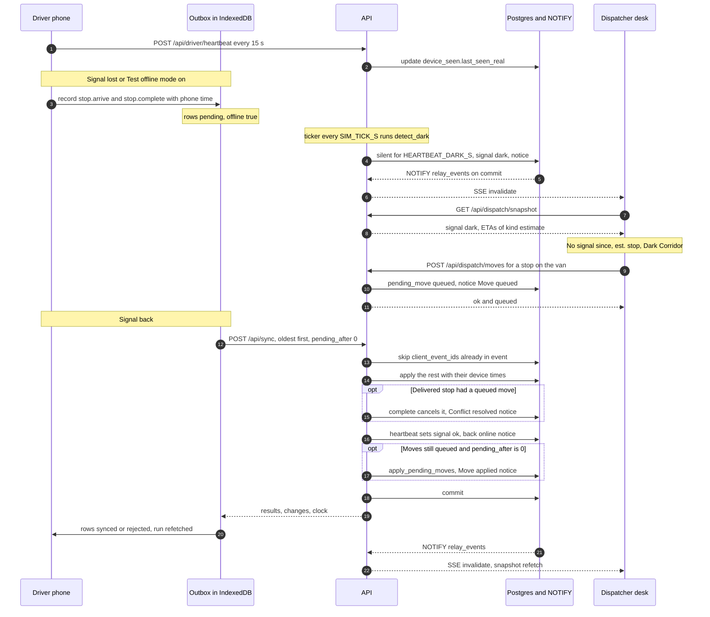

# Offline sync and recovery

How Relay keeps the driver and the dock working without a connection, how the dispatcher sees a van that has gone quiet, and how both sides are reconciled when it comes back. Everything below describes the code as it is. Paths are relative to the repository root.

| Piece | Where |
|---|---|
| Outbox: record, flush, heartbeat, Test offline mode | `apps/web/src/lib/offline/outbox.ts` |
| IndexedDB schema (Dexie) | `apps/web/src/lib/offline/db.ts` |
| Fetch wrapper with `NetworkError` and `ApiError` | `apps/web/src/lib/api.ts` |
| The virtual clock on the device | `apps/web/src/lib/clock.ts` |
| Live updates in the browser | `apps/web/src/lib/live.ts` |
| Driver: overlay, Sync tab, Me tab | `apps/web/src/roles/driver/DriverApp.tsx` |
| Store-manager PIN handover: the phone's offline check, the server's re-check | `apps/web/src/lib/handover.ts`, `apps/api/relay_api/domain/handover.py` |
| Dock: overlay and offline states | `apps/web/src/roles/dock/DockApp.tsx` |
| Dispatcher canvas: dark van, queued moves | `apps/web/src/roles/dispatch/engine/core.js`, `canvas.js` |
| `POST /api/sync`, `POST /api/driver/heartbeat` | `apps/api/relay_api/routers/field.py` |
| Applying events, heartbeat, dark detection, conflict rules | `apps/api/relay_api/domain/fieldops.py` |
| Queuing a move for a dark van | `apps/api/relay_api/domain/planning.py` (`move_order`) |
| Ticker and estimated ETAs | `apps/api/relay_api/domain/simulate.py`, `apps/api/relay_api/domain/eta.py` |
| Event log, notices, NOTIFY | `apps/api/relay_api/domain/events.py` |
| LISTEN and the SSE stream | `apps/api/relay_api/realtime.py`, `apps/api/relay_api/routers/stream.py` |
| Settings (`HEARTBEAT_DARK_S`, `SIM_TICK_S`) | `apps/api/relay_api/config.py` |
| PWA | `apps/web/vite.config.ts`, `apps/web/src/lib/pwa.ts` |

## 1. The problem

Waypoint's hill-country runs lose mobile signal for long stretches. In the demo that is VEH057, Sunil's van from the Kandy hub to Nuwara Eliya. Out of coverage the driver still arrives, unloads, takes photos, has the store manager confirm the handover with their PIN, and reports problems, so the phone has to accept all of it without a server. The dispatcher must not be left looking at a frozen or blank van: she needs to see that it is out of reach, where it probably is, and that a change she makes now cannot reach it yet. When the signal returns, every record must land exactly once, with the time it happened, and any decision made in the meantime must be reconciled with what really happened on the road. The dock has the same need on a smaller scale when the Wi-Fi at a bay drops.

## 2. Principles

1. **The server is the source of truth.** A device holds the last server view plus its own unsent records and draws one on top of the other. It never decides plan changes itself.
2. **Every field write is an event with a `client_event_id`.** The device creates the id before anything is sent. The server applies an id at most once (unique constraint `uq_event_client_id` on the `event` table).
3. **Records keep the time they happened.** Each event carries the device's virtual time. The server stores it and builds the domain timestamps from it, moving the workspace clock forward to meet it and never back.
4. **Physical facts win.** A delivery recorded offline beats a plan change made while the van could not hear it.
5. **Honest states.** Each face shows what it knows and no more: the phone says "No signal · N on phone", the dispatcher sees "No signal since HH:MM" and an estimated stop, the store sees "Estimated" arrivals.

## 3. On the phone and the tablet: the outbox

The driver and the dock send every field write through one outbox, stored in IndexedDB with Dexie (database `relay`, tables `outbox` and `cache`).

| Face | Event types | Heartbeat |
|---|---|---|
| Driver (`DriverApp.tsx`) | `run.start`, `stop.arrive`, `stop.complete`, `report` | yes, `useSyncLoop(true)` |
| Dock (`DockApp.tsx`) | `line.check`, `line.flag`, `trip.release` | no, `useSyncLoop(false)` |

**One row** (`OutboxItem` in `db.ts`):

| Field | Meaning |
|---|---|
| `id` | The `client_event_id`: a random id from `uid()` in `apps/web/src/lib/format.ts` |
| `type`, `payload` | The event, for example `stop.complete` with `stop_ids`, `visit_id`, `outcome`, `receiver`, `photo`, `pin_proof`, `note` (builds before the PIN handover also sent `lines` and `signature`; the server still accepts both) |
| `at` | The device's virtual time when it happened, a naive ISO string such as `2026-09-30T04:12:00` |
| `offline` | `true` if it was recorded while `isOnline()` was false |
| `status` | `pending`, `synced` or `rejected` |
| `createdAt` | Real time in ms. This is the send order |
| `attempts` | Failed sends so far |
| `syncedAt`, `syncedVirtual`, `message` | From the server's answer: real time, workspace time, and the reason if rejected |
| `label` | Human text for the Sync tab |

**Lifecycle.** A row starts `pending`. It becomes `synced` when the server answers `applied` or `duplicate`, and `rejected` when the server answers `rejected`. A failed request never drops a row; it only adds to `attempts`. Rows stay until the driver taps "Clear synced records" on the Sync tab (`clearSynced()` deletes `synced` and `rejected` rows).

**Recording.** `record(type, payload, label, atMs)`:

1. Picks the time with `snapTo(atMs)`: the suggested time if it is later than the device's virtual clock (the clock then jumps forward to it), otherwise the clock's current time. The driver suggests the planned departure for `run.start`, the visit's ETA for `stop.arrive`, and the arrival plus an estimated service time (8 min plus 1 min per 8 cases, at most 30) for `stop.complete`. Reports and dock writes pass no time.
2. Adds the row to IndexedDB as `pending`.
3. Starts `flush()` without waiting for it. The screen never waits for the network.

**Flushing.** `flush()`:

1. Runs once at a time per tab: a second call gets the promise already running.
2. While `isOnline()`, reads every `pending` row ordered by `createdAt` and takes the first 40.
3. Posts them to `/api/sync` with `device_id` (12 characters kept in `localStorage` under `relay.device`) and `pending_after`, the number of rows still waiting after this chunk.
4. If the request throws (`NetworkError` when there is no connection, `ApiError` when the server refuses the whole batch, for example an expired session), it adds 1 to `attempts` on the chunk and stops until the next trigger.
5. Otherwise it writes every result in one Dexie transaction, calls `setClock()` with the server's clock, tells the `onSynced()` listeners, and loops to the next chunk.

**Triggers** (`useSyncLoop()`): after every `record()`, on the browser's `online` event, on `visibilitychange`, every 10 s, when the app mounts, when Test offline mode is switched off, and from the "Sync now" button on the Sync tab.

**Heartbeat.** While `isOnline()`, the driver app posts `{pending}` (the number of pending rows) to `/api/driver/heartbeat` every 15 s. The answer carries the clock and any `changes`, which go to the same `onSynced()` listeners. An error just waits for the next beat.

**What the screen shows.** The outbox is read with Dexie's `useLiveQuery`, so these update the moment a row changes.

- *Overlay.* The driver's run is the last server copy with the phone's own rows laid over it (`overlay()` in `DriverApp.tsx`): `run.start` puts the trip `out`, `stop.arrive` marks the visit `arrived` with an actual ETA, and `stop.complete` sets the outcome and a proof that carries the row's `offline` flag, with `pin_verified` true when the row has a `pin_proof`. It uses `pending` rows and `synced` rows newer than the server copy, so a record does not blink out between "sent" and "refetched". With no server copy (for example after a reload in Test offline mode, when the run query is disabled) the base is the last copy saved in IndexedDB under `driver.run`. The dock does the same for ticks, flags and releases (`useOverlay()` in `DockApp.tsx`).
- *Driver.* The pill reads "Online · synced", "Syncing N" or "No signal · N on phone". A banner says "You're offline. Keep working." The van marker on the mini-map turns ember and the delivery window is drawn as an estimate. Finished stops still on the phone say "On phone", and the Sync tab carries a badge with the pending count.
- *Sync tab.* A connection card ("Connected" or "No signal"; "N records waiting" or "Last sync HH:MM"; "Up to date" or "Sync now"). Cards titled "A dispatch change while you were offline", built from `changes` and rejection messages (kept in `localStorage` under `relay.driver.changes`) and from the run's `move:` notices. Then every record, with "Recorded HH:MM · no signal · synced HH:MM" and a chip: Waiting, Synced, or Not applied with the server's reason.
- *Dock.* The pill reads "Offline · N saved", "Syncing N", "Live" or "Reconnecting". A bar says "No connection at the dock. Keep loading: every tick is saved on this tablet and syncs by itself." A flag raised offline shows "Saved on this tablet". A rejected record shows a toast with the server's reason.

**Test offline mode** (driver, Me tab). `setSimulatedOffline()` sets a flag kept in `localStorage` under `relay.simulateOffline`. `isOnline()` is then false although the radio is on, so the outbox stops sending, heartbeats stop, the driver's live stream closes (`useLive([["driver"]], online)`) and the run query is disabled. To the server this is the same silence as a dead zone, so the van goes dark for real. Switching it off calls `flush()` at once.

## 4. On the server

### `POST /api/sync`

`sync()` in `routers/field.py`. Any signed-in user may call it, and `ROLE_EVENTS` limits drivers and loaders to their own event types (other roles may send none). The handlers in `HANDLERS` are the same `fieldops` functions that back the dock's direct endpoints (`POST /api/dock/lines/{id}/check`, `/flag`, `POST /api/dock/trips/{id}/release`, which the API test uses). The web app sends all seven types through `/api/sync`, online or not.

Request and answer (shortened, values illustrative):

```json
{ "device_id": "4f1c9a20b7e3", "pending_after": 0,
  "events": [ { "client_event_id": "0c9e6f3a2b7d4e1f9a8b5c6d7e8f9a0b", "type": "stop.complete",
                "at": "2026-09-30T04:12:00", "offline": true,
                "payload": { "stop_ids": [812], "visit_id": 812, "outcome": "delivered", "receiver": "Fathima Rizwan",
                             "pin_proof": "ac67…", "photo": "data:image/jpeg;base64,…" } } ] }
```

```json
{ "results": [ { "client_event_id": "0c9e6f3a2b7d4e1f9a8b5c6d7e8f9a0b", "status": "applied", "result": { "ok": true, "conflicts": [] } } ],
  "changes": [], "clock": { "now": "2026-09-30T04:12:00", "paused": true, "…": "…" } }
```

For each event, in the order received:

1. If an `event` row with the same `workspace_id` and `client_event_id` exists, answer `duplicate` with its stored `result` and do nothing else. If that first attempt was refused, answer `rejected` again with the stored reason, so a lost answer never turns a refusal into "synced".
2. If the user's role may not send this type, answer `rejected` ("driver cannot send line.check").
3. In a savepoint (`db.begin_nested()`), run the handler, then `record()` a `sync.<type>` event that carries the `client_event_id`, the device time (`device_at`) and the handler's result. Answer `applied`.
4. A `FieldError` (a business rule said no) rolls back the savepoint, records `sync.rejected.<type>` under the same `client_event_id`, and answers `rejected` with the reason. A `KeyError`, `ValueError` or `TypeError` answers `rejected` with "Malformed event: …" and is not recorded. An `IntegrityError` rolls back only that event's savepoint: if the row now exists (two requests raced with the same rows) the answer is `duplicate`; otherwise the event is `rejected` ("This record no longer matches the plan, so it could not be saved."). Either way the events before it in the same request stay applied.

After the loop, for a driver, the request also counts as a heartbeat: `heartbeat(db, ws, user, pending_after)` runs and its `changes` go back in the answer. `pending_after` is ignored for other roles. Then one commit for the whole request.

| Status | Meaning | The device marks the row |
|---|---|---|
| `applied` | The handler ran and the change is committed | `synced` |
| `duplicate` | This `client_event_id` was seen before; nothing ran again | `synced` |
| `rejected` | The role may not send it, a business rule refused it, or the payload is malformed | `rejected`, with `message` |

**The same fact twice.** Besides the id check, the handlers tolerate a fact that arrives again under a new id: `start_run()` and `release_trip()` answer `already: true` for a trip that has moved on, `arrive()` only changes stops that are still `pending`, and `complete()` skips stops already finished. An arrival or delivery for a van that is still `loaded` starts the run first.

**Order.** Events are applied in batch order. The device sends oldest first by `createdAt`, one chunk at a time, and waits for each answer (the server accepts up to 200 events per request; the client sends 40). Each event is checked against the server state at the moment it is applied. There is no global order across devices.

**Device time and server time.** `event` rows carry `virtual_at` (the workspace clock when the row was written), `server_at` (real UTC) and, on the `sync.<type>` rows, `device_at` (the device's `at`). The domain timestamps (`arrived_at`, `completed_at`, the proof's `captured_at`, `released_at` and so on) come from `_when(ws, at, floor)`: the device time, or the current virtual time if `at` is missing, never earlier than a floor. `advance_to()` then moves the workspace clock forward if the device is ahead. `stop.synced_at` records when the server received a delivery, and `stop.recorded_offline` keeps the `offline` flag.

| Event | Handler | Floor on the time |
|---|---|---|
| `run.start` | `start_run()` | planned departure |
| `stop.arrive` | `arrive()` | earliest planned arrival of the visit, only when `at` is missing |
| `stop.complete` | `complete()` | arrival (or planned start) + 8 min, only when `at` is missing |
| `report` | `report_problem()` | none |
| `line.check` | `check_line()` | departure − 75 min, on a trip's first tick |
| `line.flag` | `flag_line()` | none |
| `trip.release` | `release_trip()` | departure − 10 min |

The device keeps its own copy of the clock in `localStorage` (`relay.clock`). `setClock()` in `clock.ts` refuses to move it back by more than a second once it has had a server clock, because a phone that recorded offline can be ahead of the server.

### The store-manager PIN handover

Each store manager has one fixed delivery PIN (`app_user.delivery_pin`, seeded from `STORE_PINS` in `seed/__init__.py`; Fathima's demo PIN is 4826 and she sees it on her Profile page). It replaces the finger signature, and it works with no signal:

1. `driver_run()` in `views.py` marks each visit `pin_required` when its outlet has a store manager with a PIN, and adds `pin_check`: the SHA-256 of `relay-handover:{visit_id}:{pin}` (`pin_check()` in `domain/handover.py`). The PIN itself is never in the run. The run is cached in IndexedDB like any other, so the check works in a dead zone.
2. At the door the driver hands over the phone and the manager types the PIN into a masked field. `pinCheck()` in `apps/web/src/lib/handover.ts` compares it with `pin_check` (js-sha256, because browsers withhold `crypto.subtle` on plain http, which is how phones test over the LAN). On a match the screen clears the PIN at once and keeps only `pinProof()`, the SHA-256 of `relay-handover-proof:{visit_id}:{pin}`. The PIN is never written to IndexedDB, `localStorage`, logs or toasts: the outbox row carries `visit_id` and `pin_proof` only. After three wrong tries the driver can choose "Record without PIN" and type the receiver's name instead.
3. `complete()` re-verifies on the server: `visit_id` must be one of the visit's `stop_ids`, and `pin_proof` must equal `pin_proof(visit_id, manager's PIN)` (`verify()`, a constant-time compare). Then every proof row of the visit gets `pin_verified = true` and the manager's name as receiver, and the store's notice adds "Confirmed with your PIN."
4. A missing or wrong proof never blocks the delivery (physical facts win). It is recorded with `pin_verified = false` and the driver's receiver name, the store's notice says it was recorded without their PIN and asks them to confirm what arrived, and the dispatcher gets an amber "{store} · delivered without the store's PIN". Refused and closed stops have no handover, so no PIN is expected; outlets without a registered manager keep the receiver name as before.

The proof is a different hash from the check value on purpose: the phone already holds `pin_check`, so sending it back must not count as a confirmation. A determined person holding the run could still brute-force a 4-digit `pin_check` offline. That is acceptable for a handover confirmation; production would use per-delivery codes or a signed QR code.

### Heartbeat, going dark, coming back

`POST /api/driver/heartbeat` calls `heartbeat()` in `fieldops.py`, which updates `device_seen` (`last_seen_real`, `last_virtual`, `pending`). For each of the driver's trips that day that is `dark`, it sets `signal` back to `ok`, resolves the `dark:<trip>` notice, posts "VEH057 back online" to the dispatcher (with "· N records syncing" when `pending` is above 0) and the body "Dark for X. Each record keeps the time it happened, not the time it arrived.", and tells the van's stores and the van to refetch. Then, **only if `pending` is 0**, it calls `apply_pending_moves()`. `_dark_for()` gives the dark time on the demo clock if that moved at least a minute, otherwise in real seconds or minutes since the last heartbeat (with the clock paused, a van can be dark for a minute of real time at one virtual instant).

`detect_dark()` runs at the start of every simulation tick (`advance()` in `simulate.py`, every `SIM_TICK_S`, 4 s by default). A trip that is `out`, driven by a person (`controlled == "human"`), whose driver's `device_seen.last_seen_real` is older than `HEARTBEAT_DARK_S` (45 s by default; the CI browser test uses 15) becomes `signal = "dark"`, with `dark_since` set to the last time the phone was heard: the later of its last heartbeat (`device_seen.last_virtual`) and the trip's `last_contact_at` (moved by the run start, each arrival or delivery, and a return from dark). The dispatcher gets "VEH057 has no signal" ("… Its stores now see estimated arrivals. Anything you change on this van waits for its phone."), and the van's stores are told to refetch.

While the van is dark:

- `live_etas()` in `domain/eta.py` labels its projected ETAs `estimate` instead of `predicted`.
- The canvas shows "No signal since HH:MM" and "est. stop N" on the trip, and a Dark Corridor block in the trip inspector (`darkCorridorHTML()` in `canvas.js`). The estimated stop counts the delivered stops plus those whose ETA has passed (`vehiclePos()` in `core.js`).
- The store sees "Estimated" arrival times and "VEH057 is out of coverage. The arrival is an estimate until it reconnects." (`StoreApp.tsx`).
- A move does not touch the van. `move_order()` in `planning.py` checks the target as usual (`check_target()`), but when the stop's trip is `out` and `dark` it stores a `pending_move` with status `queued`, posts "Move queued: {store} → {van}" to the dispatcher and "New stop: {store}" to the target van, and answers `queued: true`. The canvas marks the order "Move queued · applies on sync".

## 5. Going dark and coming back



The order inside one `/api/sync` request is what makes "physical facts win" hold. The phone's records are applied first, so a delivery cancels its own queued move inside `complete()`. Then the heartbeat turns the van back to `ok`, and only if `pending_after` is 0 are the remaining queued moves applied. Applying a move first would be wrong: `_apply_move()` deletes the stop from the van, and the delivery would then be rejected as an unknown stop. With more than 40 records the phone sends several requests, and `pending_after` stays above 0 until the last one. `apply_pending_moves()` also checks again and cancels a move whose stop is already finished.

Dark detection needs the ticker, and the ticker runs only while at least one browser holds `/api/stream` open on that workspace (section 7).

## 6. Conflict rules

| Situation | Outcome | Who is told | Code |
|---|---|---|---|
| The same record arrives again (lost answer, retry, second tab) | `duplicate`; nothing runs twice | Nobody; the row turns `synced` | `sync()` |
| A delivery recorded offline for a stop the dispatcher moved while the van was dark | The delivery stands with its device time; the move becomes `cancelled` | Dispatcher: "Conflict resolved: delivery kept". Target van: "Skip {store}". Store: the usual delivery notice, "… while out of coverage" | `complete()` |
| A move queued while dark, and the van never reached that stop | Applied once the phone has nothing left to send | Dispatcher: "Move applied: {store} on {van}". Dark van: "{store} moved to {van}" and a change card on the Sync tab. Target dock: "Stage {store} for {van} trip N". Store: "Your order is on a different van" | `heartbeat()`, `apply_pending_moves()`, `_apply_move()` |
| A queued move whose target can no longer take it when the van comes back | `cancelled`, resolution "Could not apply: …" | Nobody (see section 10) | `apply_pending_moves()` |
| The dispatcher moved a stop before the van was marked dark (signal still `ok`) | The move applies at once and the stop is recreated on the new trip; a later record for the old stop is `rejected` ("Unknown stop.") | Driver: "Not applied" with the reason, and a toast | `_apply_move()`, `_stops_for()` |
| The dispatcher moves a stop the server already has as arrived or finished | Refused with 409 ("{store} was already delivered at HH:MM.") | Dispatcher: a toast | `move_order()` |
| A dock record the server no longer allows (a tick on a truck already released or on a flagged line, a release with a shortfall open or lines still to load) | `rejected` with the reason | Loader: a toast; the screen falls back to the server state | `check_line()`, `release_trip()` |
| A run started twice, a truck released twice | Accepted, no change (`already: true`) | Nobody | `start_run()`, `release_trip()` |
| An event type the role may not send, or a malformed payload | `rejected` | The sender, on screen | `sync()` |

Notices replace each other by key (`post_notice(key=…)` in `events.py`) and the feeds hide resolved notices, so each story shows its latest state: `dark:<trip>` disappears when the van is back, and `move:<order>` goes from "Move queued" to "Conflict resolved: delivery kept" or "Move applied".

## 7. Live updates

Live updates are an invalidation signal, not a data feed.

1. `record()`, `post_notice()` and a few direct calls use `notify()`, which runs `pg_notify('relay_events', …)` with `{ws, topics, kind}` in the same transaction as the change. Postgres delivers it only if the transaction commits.
2. One listener thread per API process `LISTEN`s on `relay_events` (`Hub._listen()` in `realtime.py`, reconnecting after 2 s if the connection drops) and passes each message to the streams of that workspace whose interests match.
3. `GET /api/stream` sends `retry: 3000`, a `hello` event, then `invalidate` events with `{topics, kinds}` (bursts coalesced for 250 ms), and a `clock` event after 15 s without news, which also keeps the connection alive.
4. `useLive()` in `live.ts` invalidates the role's React Query keys on each `invalidate`, and the queries refetch the REST views. A `reset` kind also fires a `relay:reset` window event.

| Role | Stream interests | Keys refetched | Polling while the stream is down |
|---|---|---|---|
| Dispatcher | `*` | `["dispatch"]` | snapshot every 8 s (every 30 s even when live) |
| Loader | `plan`, `clock`, `depot:<depot>` | `["dock"]` | queue every 15 s |
| Driver | `plan`, `clock`, `vehicle:<id>` | `["driver"]` | run every 20 s, only while online |
| Store | `plan`, `clock`, `outlet:<id>` | `["store"]` | home every 20 s |

**Reconnect.** On an error the browser marks the stream down (`useLiveStatus()` turns false, which switches polling on). The `EventSource` retries by itself; if it ends up closed, the client opens a new one after 4 s. The driver's stream is closed on purpose while offline.

**Why REST stays the source of truth.** The stream carries topic names, never data. Every screen is drawn from the REST views in `apps/api/relay_api/domain/views.py`, so a lost, late or doubled signal costs at most one refetch, nothing has to be replayed or merged in the browser, and the offline copy of the run has the same shape as the live one.

**The ticker.** The same `Hub` runs one ticker per watched workspace (`Hub._tick()`), which calls `advance()` every `SIM_TICK_S` while anyone holds a stream open on that workspace. `advance()` takes a transaction-scoped advisory lock per workspace, so with several API instances only one works on a workspace at a time. `detect_dark()` runs there.

## 8. The PWA shell

`vite-plugin-pwa` with Workbox, configured in `apps/web/vite.config.ts`:

| What | Service worker | Notes |
|---|---|---|
| `index.html`, the JS and CSS of all four faces, icons, the web manifest | Precached | `globPatterns: **/*.{js,css,html,png,svg,woff2}`, files up to 4 MB. Navigations fall back to `/index.html` |
| Google Fonts | Runtime cache `fonts`, stale-while-revalidate | |
| Anything under `/api/` | Never | Listed in `navigateFallbackDenylist` and matched by no runtime route. Offline data lives in IndexedDB instead |

`registerType` is `"prompt"`: when a new build is deployed, `registerUpdates()` in `pwa.ts` shows "A new version of Relay is ready." with a Reload button. The API serves `sw.js` and `manifest.webmanifest` with `Cache-Control: no-cache` (`apps/api/relay_api/main.py`), so a deploy is noticed. The service worker is registered only in production builds (`registerUpdates()` returns early in development), so try the offline shell with `docker compose up` (http://localhost:8080) or the deployed app, not `make dev`.

## 9. How to see it yourself

**By hand.** Sign in to each role in its own browser window or profile, because the session is a cookie. The password is `relay2026`. "Start a private sandbox" on the sign-in page gives you a workspace nobody else touches; use its code for every role.

1. Get VEH057 on the road. The presenter checklist on the dispatcher's desk (Demo button) lists the steps: plan and publish as `nirosha@waypoint.lk`, load and release VEH057 at the Kandy dock as `kasun@waypoint.lk`, then "Start run" as `sunil@waypoint.lk`. Dark detection only looks at trips that are `out`.
2. Driver: Me, then "Test offline mode". The pill turns to "No signal". Deliver the next stop (swipe to arrive, photo, and at Fathima's store her PIN 4826, then swipe to complete). The Sync tab lists the records as "Waiting" with "no signal".
3. Dispatcher: within about a minute (`HEARTBEAT_DARK_S` plus one tick) VEH057 shows "No signal since HH:MM" and "est. stop N", the feed shows "VEH057 has no signal", and the trip inspector shows the Dark Corridor block. A store still waiting for VEH057 sees "Estimated" and the out-of-coverage note (the store account is `fathima@waypoint.lk`).
4. Dispatcher: in the Dark Corridor block, click "Move {store}…". The dialog asks "Move {store} while Sunil can’t hear you?" and tags the first legal option "Queue until sync". Pick it: the toast says the stop will move when VEH057 reconnects, and the order shows "Move queued · applies on sync".
5. Driver: deliver that stop too (to see "Conflict resolved: delivery kept") or leave it (to see "Move applied"). Then switch "Test offline mode" off.
6. Watch the Sync tab turn rows to "Synced" with their original "Recorded" times, and the dispatcher's feed show "VEH057 back online" with "Dark for …" and the conflict outcome. The order's proof in the inspector reads "recorded HH:MM offline · synced".

The same flow works with real airplane mode on a phone, as long as the app is already open (section 10). Switch Test offline mode off before signing out: the flag belongs to the browser.

**Automated.**

- `apps/api/tests/test_walkthrough.py`, run by `make test` (which starts Postgres; without a database the API tests skip). `test_full_walkthrough` sends `run.start`, `stop.arrive` and `stop.complete`, expects three `applied`, then resends the same batch and expects three `duplicate`. It sets `device_seen.last_seen_real` five minutes back, runs `advance()` and expects `signal == "dark"`. It queues a move for the last visit (when `/api/dispatch/moves/options` offers a legal target), then syncs the remaining visits with device times and `offline: true`: every result is `applied`, every visit's `completed_at` equals the time the phone recorded, the queued move is `cancelled` with "delivered" in its resolution, and the order is `delivered` with `proof.offline` true. Fathima's `stop.complete` carries `visit_id` and `pin_proof` wherever her visit falls, and her delivery ends with `pin_verified` true and her name as receiver. `test_sync_keeps_applied_events_when_a_later_one_fails` sends a good and a bad record in one batch: the good one stays applied, the bad one is `rejected`, and a resend answers `duplicate` and `rejected` again.
- `apps/api/tests/test_handover.py`: only Fathima's own `/api/store/profile` returns her PIN (the other roles get 403); the run carries `pin_check` for her visit and never the PIN; a wrong `pin_proof` still records the delivery with `pin_verified` false and posts "… delivered without the store's PIN" to dispatch; a resent confirmation answers `duplicate`.
- `e2e/tests/walkthrough.spec.ts`, run by `make e2e` (with `make dev` running) or `make e2e-docker`; `deliverNextStop()` types Fathima's PIN (read once from `/api/store/profile`) whenever the PIN card appears, online or offline; the CI job `e2e` in `.github/workflows/ci.yml` sets `HEARTBEAT_DARK_S=15`. The step "the van loses signal…" turns on Test offline mode, delivers a stop on the phone only, and waits for `signal == "dark"` and a `.tn.dark` node on the canvas. "the dispatcher queues a move for the dark van" uses the Dark Corridor block and waits for a pending move. "back online…" delivers the remaining stops offline, switches the mode off, and waits for "Conflict resolved: delivery kept" or "Move applied" in the feed and for `signal == "ok"`.

Neither test compares the stored timestamps with the device times; they check statuses and outcomes.

## 10. Limits and known gaps

- **Dark detection needs someone watching.** `detect_dark()` runs only inside the ticker, which runs only while some browser holds `/api/stream` open on that workspace. It only considers trips that are `out`, driven by a person, whose driver has sent at least one heartbeat.
- **Page timers only.** Heartbeats and retries are timers in the open page; there is no Background Sync. A phone that suspends the page in the background stops heartbeating, so the van can show "No signal" while it has signal, and its records wait until the app is in front again.
- **Reloading with no network.** The service worker serves the shell. `useMe()` in `apps/web/src/lib/auth.tsx` falls back to the last signed-in user saved on this device (`relay.me` in localStorage) when `GET /api/auth/me` fails for lack of network, and the driver's run comes from the IndexedDB copy, so a reload in a dead zone reopens the last state. The server still checks the session when the phone syncs. Other faces have no offline copy of their data.
- **Only the driver and the dock queue writes.** Store orders and receipts, every dispatcher action, the dock's "It's off the truck" and reminder buttons, and the driver's "Got it" on a notice are direct requests. Without a connection they fail politely: the notice simply stays until it can be marked read.
- **Batch failures are quiet.** If a whole batch is refused (an expired session, a server error), the rows stay `pending` and are retried every 10 s without backoff. The reason only goes to the console, and `attempts` is not shown anywhere.
- **Queued moves.** They have no timeout and no cancel action, so a move waits for the phone however long that takes. A second decision for the same order replaces the first queued move (one queued move per order). A move that fails `check_target()` when the van comes back is cancelled and the dispatcher sees "Move not applied" with the reason.
- **Device time is trusted.** The server applies the floors in section 4 but no upper bound, and a device that is ahead pushes the shared workspace clock forward.
- **The estimated stop is rough.** On every snapshot `live_etas()` moves an overdue ETA to now + 2 min, so the estimate falls back to the stop after the last synced one on each refresh and only creeps forward in between (not at all while the demo clock is paused).
- **The outbox belongs to the browser, not the user.** Rows do not record who made them. The Test offline mode flag also pauses the dock's outbox in the same browser, and the dock has no switch. The screens overlay only the newest 80 rows (`useOutbox()`); older unsent rows are still sent but not drawn, which matters on the dock, where every ticked line is a row. Photos travel inline as data URLs.
- **The PIN check can be guessed offline.** The phone holds a one-way `pin_check` per visit, and a fixed 4-digit PIN falls to 10,000 guesses. It confirms a handover; it is not a login (section 4).
- **No replay on the stream.** Stream events have no ids and the browser does not refetch on `hello`, so a change made between the last poll and a reconnect waits for the next signal or a window focus. The dispatcher also polls every 30 s while live.
