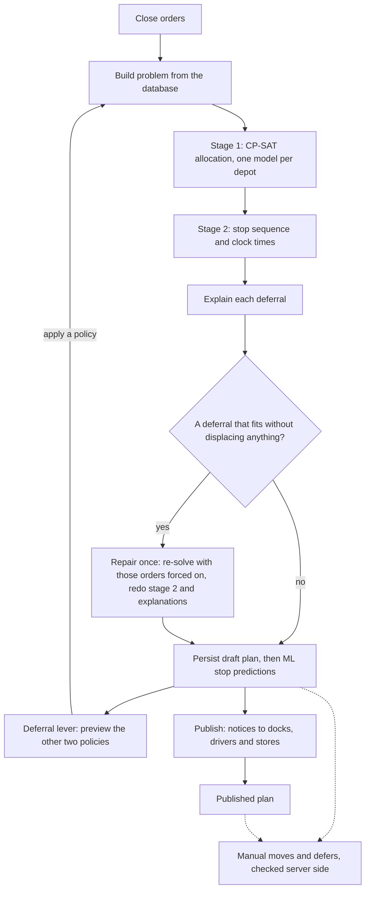

# Planning engine

The planning engine decides, for one service day, which order rides on which vehicle and trip, the stop order and clock times of every trip, and why each order that is not served has to wait until tomorrow. It is a plain Python package with no database or web code (`packages/engine/relay_engine`, built on OR-Tools CP-SAT). The API connects it to the database in `apps/api/relay_api/domain/planning.py`. The same `plan()` function plans the app's day and the Datathon Task 2B peak day.

This document describes what the code does today. The figures come from runs on a laptop-class machine with 2 vCPUs.

| File | What it does |
|---|---|
| `packages/engine/relay_engine/core.py` | Data types (`Order`, `Vehicle`, `Problem`, `TripPlan`, `Deferral`, `Solution`), the 270 and 480 minute budgets and the two-trip limit |
| `packages/engine/relay_engine/model.py` | Stage 1: the CP-SAT model, greedy warm start, phased depot solve, continuity relabelling |
| `packages/engine/relay_engine/policies.py` | The three deferral policies as objective weights |
| `packages/engine/relay_engine/planner.py` | `plan()`: depot solves in parallel, stage 2, explanations, repair, KPIs |
| `packages/engine/relay_engine/timetable.py` | Stage 2: trip order, stop sequence, clock times, late flags |
| `packages/engine/relay_engine/explain.py` | Deferral reasons: static checks and counterfactual re-solves |
| `packages/engine/relay_engine/standards.py` | Planning-standard minutes, km and litres; CSV loaders |
| `packages/engine/relay_engine/validate.py` | `validate_allocation()` (port of the organisers' `check_allocation.py`, plus fuel) and `check_move()` |
| `packages/engine/relay_engine/task2b.py` | Datathon Task 2B command |
| `apps/api/relay_api/domain/planning.py` | Cutoff, problem building, persisting, publishing, the lever, manual moves and defers |
| `apps/api/relay_api/routers/dispatch.py` | Dispatcher HTTP endpoints (`/api/dispatch/...`) |
| `apps/api/relay_api/domain/eta.py` | ML stop predictions and live ETAs |
| `apps/api/relay_api/check_plan.py` | `make check-plan` |

## 1. What the engine decides

**Inputs.** `build_problem()` in `planning.py` reads:

- the day's orders in state `confirmed`, `planned` or `deferred`: brand (Fresh, Style, Tech), temperature (chilled, ambient), weight, volume, `deferred_yesterday` and `days_since_served`; and from the outlet: district, home depot, dock type, parking (`normal`, `van_only`, `mall_dock`), delivery window, mall window and usual vehicle for that temperature;
- every vehicle in `vehicles.csv` (truck or van, reefer or ambient, weight and volume capacity, km per litre, home depot), whether it is in the workshop today (`VehicleDay.status`), and its fuel left this week (weekly quota minus fuel used);
- the planning standard: `district_travel.csv` (depot-to-district and inter-stop minutes and km) and `service_allowance.csv` (handling minutes by brand and dock type);
- the policy on the deferral lever, and pins for trips the dispatcher has locked.

**Outputs.** `plan()` returns a `Solution`:

- `assignments`: order → (vehicle, trip 1 or 2);
- `trips`: per trip the stop sequence, departure, each stop's arrival, start and finish, the return time, and planning-standard minutes, km, litres, m³ and kg;
- `deferred`: one `Deferral` (kind, code, text, cost) for every order not served;
- `kpis`: orders, served, deferred, m³ and chilled m³ served, repeat skips, trips, vehicles, km, litres and planned late stops, per depot and in total, plus solver status, time, model size and gap per depot (`depot_status`).



`close_orders()` confirms the day's orders at the cutoff and places standing orders that nobody replaced. `POST /api/dispatch/plans` closes orders if that has not happened, then runs `solve()` (`build_problem()` + `plan()`) and `persist()`; with `"publish": true` it also publishes.

## 2. The rules

Stage 1 makes every rule a hard constraint. `validate_allocation()` checks the result independently.

| Rule | Enforced in stage 1 (`model.py`) | Checked in `validate.py` (rule code) |
|---|---|---|
| Whole orders, each served at most once | `AddAtMostOne` over the order's `x` variables | one entry per order in `assignments` |
| No workshop vehicles | unavailable vehicles are left out of the model (`solve_depot`, `fits_alone`) | `workshop` |
| Vehicles serve their home depot only | one model per depot; `fits_alone` requires `v.depot == o.depot` | `depot` |
| One brand and one district per trip | combo variables `y[v,t,c]`, `Σ_c y = u`, `x → y[v,t,combo(o)]` | `brand`, `district` |
| Chilled goods only on a reefer | no `x` variable for other vehicles (`fits_alone`) | `reefer` |
| `van_only` outlets only by van | no `x` variable for trucks (`fits_alone`) | `van_only` |
| Volume per trip | `Σ ⌈1000·m³⌉·x ≤ ⌊1000·cap⌋·u` (litres; demand rounded up, capacity down) | `volume` |
| Weight per trip | `Σ ⌈10·kg⌉·x ≤ ⌊10·cap_kg⌋·u` (tenths of a kg) | `weight` |
| At most two trips per vehicle | trip slots `t ∈ {1, 2}` only (`max_trips`) | `trips`, `trip_id` (must be 1 or 2) |
| Fresh trips of one vehicle ≤ 270 min (booklet window 03:30–08:00) | per-vehicle sum of Fresh trip minutes ≤ `budget_fresh` | `fresh_window` |
| Style and Tech trips of one vehicle ≤ 480 min | per-vehicle sum of other trip minutes ≤ `budget_day` | `day_window` |
| Weekly fuel quota | per-vehicle km (return leg included) ≤ `fuel_left_l × km_per_l` | `fuel` (our addition; off for Task 2B) |

Trip time follows the published standard. `trip_minutes()` in `standards.py` is a port of `trip_time()` in the organisers' checker: depot-to-district minutes once, inter-stop minutes `n − 1` times, plus the handling allowance of every stop. The return leg is not counted in minutes ("the stated budgets already allow for it") but is counted in km, because distance is what uses fuel: `km = 2 × depot_to_district_km + (n − 1) × inter_stop_km`. The booklet's examples (Fresh to Gampaha with two rear docks and a street stop = 101 min; Colombo with four street stops = 112 min) are unit tests.

## 3. Stage 1: allocation with CP-SAT

`model.py` builds one model per depot. Depots never share vehicles, so they are independent problems.

**Pre-filter.** `fits_alone(o, v)` asks whether order `o` could ride on vehicle `v` with nothing else on board: available, same depot, reefer for chilled, van for `van_only`, within capacity, one stop alone within the 270 or 480 minute budget, and fuel for the round trip. Variables exist only for compatible pairs, so refrigeration, van access, home depot and workshop rules hold by construction.

**Decision variables** (`_solve()`)

- `x[o,v,t]`: order `o` rides on vehicle `v`, trip slot `t ∈ {1, 2}`.
- `y[v,t,c]`: slot `(v,t)` serves combo `c = (brand, district)`; created only for combos with a compatible order.
- `u[v,t]`: slot `(v,t)` is used.
- `twofresh[v]`: vehicle `v` runs two Fresh trips.

**Constraints**

```text
at most once        Σ_v,t x[o,v,t] ≤ 1
order needs combo   x[o,v,t] → y[v,t,combo(o)]
one combo per trip  Σ_c y[v,t,c] = u[v,t]
no empty trips      y[v,t,c] ≤ Σ x[o,v,t] over the orders o of combo c
volume              Σ ⌈1000·m³_o⌉·x[o,v,t] ≤ ⌊1000·cap_m³⌋·u[v,t]
weight              Σ ⌈10·kg_o⌉·x[o,v,t] ≤ ⌊10·cap_kg⌋·u[v,t]
Fresh minutes       Σ over Fresh combos (d2d − inter)·y + Σ over Fresh orders (inter + allowance)·x ≤ 270
daytime minutes     the same over Style and Tech ≤ 480          (both summed over the vehicle's two slots)
fuel                Σ ⌈10·(2·d2d_km − inter_km)⌉·y + Σ ⌈10·inter_km⌉·x ≤ ⌊10 · fuel_left_l · km_per_l⌋
```

Because exactly one `y` is set on a used slot, the minute terms add up to `d2d + (n − 1)·inter + Σ allowance`, the checker's formula. The km terms add up to `2·d2d_km + (n − 1)·inter_km`.

Symmetry breaking (search aids, not rules): slot 2 is used only if slot 1 is (`u[v,2] → u[v,1]`); when both are used, slot 1's combo index is not above slot 2's (combos are numbered alphabetically by brand and district); interchangeable vehicles (same `vehicle_class()`: type, refrigeration, capacities, km/L and fuel, and no pins) are used in id order with non-increasing trip counts.

**Objective.** One weighted sum, maximised:

```text
  Σ_o order_score(o, policy) · (o is served)
+   6 · (o rides on its usual vehicle)            CONTINUITY_BONUS
−  40 · (trip slots used)                         TRIP_COST
−   1 · (km driven, whole km, return included)    KM_COST
− 150 · (vehicles running two Fresh trips)        SECOND_FRESH_TRIP_COST
```

`order_score()` in `policies.py` combines a priority `base` with a repeat-skip term and a volume term. `base = class value × urgency`: chilled Fresh 100, ambient Fresh 80, Tech 60, Style 50, and `urgency = 1 + 0.2 × min(max(days_since_served − 1, 0), 5)`, so 1.0 to 2.0. Volume counts up to 40 m³.

| Term of `order_score()` | Max throughput | Balanced | Fairness first |
|---|---|---|---|
| Constant per served order | 10,000 | 2,000 | 1,000 |
| Multiplier on `base` | 1 | 20 | 10 |
| Repeat skip (`deferred_yesterday`) | 50 | 3,000 | 1,000,000 |
| Per m³ | 2 | 5 | 5 |

Two 2 m³ chilled Fresh orders show the effect. Order A was served yesterday (`base` 100). Order B was skipped yesterday and has gone two days without service (`base` 120). Scores: throughput A 10,104, B 10,174; balanced A 4,010, B 7,410; fairness A 2,010, B 1,002,210. Under throughput, one more served order is worth more than the priority gap between any two orders: the constant is 10,000, while scores spread over only about 280. Balanced gives up one A to serve B but not two. Fairness serves B whatever it displaces. The tiers are a weighted sum, not a strict lexicographic order (see Known gaps in section 10).

**Solving a depot.** `solve_depot()` runs one full solve when a hint is passed (counterfactuals, repair) or when the depot has no chilled orders. Otherwise it runs three phases inside the depot's time limit `L`:

| Phase | Model | Hint | Time |
|---|---|---|---|
| A | chilled orders on reefers only | greedy | `max(0.3, min(0.35·L, 3))` s |
| B | all orders and vehicles, phase A's cold-chain choices pinned | phase A + greedy completion | `max(0.3, 0.6 × time left)` s |
| C | all orders and vehicles, no phase A pins | best so far | the rest, if more than 0.5 s is left |

The plan kept is the best of the greedy completion, phase B and phase C. They are compared by `objective_of()`, which evaluates the same objective terms in Python. The depot status is `OPTIMAL` only if phase C proves optimality and is kept; otherwise it is `FEASIBLE`. `DepotResult.notes` records the phase A result and which plan was kept.

**Warm start.** `greedy()` places orders in this order: the most constrained first (four or fewer compatible vehicles), then by descending policy score, then by volume. Each order goes to its usual vehicle if it can take it. Failing that, it joins the same-combo trip with the least volume left over. Failing that, it opens a new trip on the smallest vehicle that can carry the rest of that combo's demand, or the largest if none can. The greedy respects capacity, the 270 and 480 minute budgets, fuel and the two-trip limit. The hint is passed with `AddHint` on every `x` variable.

**Continuity.** After each solve, `relabel_for_continuity()` swaps whole schedules between interchangeable vehicles so that as many orders as possible ride on their usual vehicle and driver. Interchangeable vehicles are identical for every constraint, so nothing else changes. A second pass, `_swap_for_continuity()`, also swaps the days of two vehicles that are compatible but not identical (for example, the same van with a different amount of fuel left), when that puts more outlets back on their usual vehicle and `validate_allocation()` accepts both days. Trips, kilometres and service are unchanged. Without it, the time-limited search handed the hill run to a different van in about one plan in eight. Vehicles carrying pins are never relabelled.

**Parallelism and limits.** `plan()` solves the depots (Peliyagoda, Kandy) in a thread pool, one thread per depot. CP-SAT workers per depot are `max(2, min(workers, 2 × cpu_count // depots))`, which gives 2 workers on 2 vCPUs and 8 on 8 cores. The random seed is 7. The API sets the stage 1 limit per depot to `SOLVER_TIME_LIMIT_S` (default 5 s; the engine's own default is 6 s). `Problem.deterministic` (one worker, deterministic time) exists for reproducible runs, but no caller sets it.

**Pins.** `build_problem()` turns every stop of a trip that is `locked` (`POST /api/dispatch/trips/{id}/lock` toggles it) or no longer `planned` into a `Pin(order, vehicle, trip_no)`. In `_solve()` a pin fixes `x = 1`. The vehicle stays compatible even if the order would no longer fit alone, and a pin on a vehicle that has gone to the workshop is dropped with a note. `persist()` refuses to replace a plan once any trip has left `planned`, so in a saved re-plan the pins come from locked trips. Pins from started trips only appear in lever previews.

**Repair.** A counterfactual (section 5) that serves a deferred order without displacing anything shows that the time-limited search left value behind. `plan()` collects those orders, re-solves each affected depot once with all of them forced on (`force_served`, limit `max(1.5, 0.5·L)` s, hinted with the current plan), and keeps the result if its objective is higher. If any depot improved, it rebuilds stage 2 and re-explains the remaining deferrals with 60% of the explanation budget.

## 4. Stage 2: sequencing and timetable

Stage 1 guarantees the planning standard but ignores clock times. `build_trips()` in `planner.py` turns each `(vehicle, slot)` group into a `TripPlan`. `timetable_vehicle()` in `timetable.py` then times each vehicle's trips:

1. **Trip order.** Fresh trips come first (pre-dawn), then Style and Tech trips, sorted by their earliest-closing window. When a vehicle has two Fresh trips, both orders are tried with every first departure from 03:30 to the latest useful one in 10-minute steps. The timetable with the least total lateness wins, with the least waiting as the tie-break. Trips are renumbered 1..n in this order, and the plan's assignments use these numbers.
2. **Stop order.** Earliest deadline first: window close, then window open. A `mall_dock` outlet with a mall window uses the mall window (`stop_window()`).
3. **Clock.** Arrival is the previous finish plus the inter-stop minutes. Two consecutive orders for the same outlet count as one visit with no extra travel. Service starts at `max(arrival, window open)`, so a van that arrives early waits. Finish is start plus the planning-standard allowance. The van returns to the depot at the last finish plus the depot-to-district minutes.
4. **Departure.** `best_departure()` starts from arriving at the first stop as it opens. It pulls the departure earlier by the worst overrun (up to four passes), then rounds down to 5 minutes. It never goes earlier than 03:30 for Fresh (the start of the booklet's Fresh operating window), 06:00 for Style and Tech, or the previous return plus 20 minutes of reloading.
5. **Late flag.** `StopTime.late` is set when the planned arrival is after the window closes. It is stored as `Stop.late_planned` and counted in the `late_stops` KPI. Windows never move an order to another trip; a late stop is a risk shown to the dispatcher before publishing.

**ML predictions.** After `persist()`, and whenever `retimetable()` re-times a vehicle after a manual change, `predict_trip()` in `eta.py` builds one feature row per stop. The features are brand, district, dock, parking, temperature, vehicle type, drop size, position on the route, planned arrival against the window, leg km and minutes, day of week, monsoon and the traffic speed index for that district and hour. It stores the predicted service minutes (`Stop.pred_service_min`) and the probability of arriving after the window (`Stop.late_prob`). `packages/ml/relay_ml/predict.py` uses the LightGBM boosters in `packages/ml/models/` when they are present. They are trained from the private competition data, so git ignores them, but they ship in the starter zip, the Docker image and the Cloud Run deployment: `meta.json` records a validation service-time MAE of 4.73 min against 7.30 min for the allowance, and a lateness AUC of 0.969. Without them it uses a transparent heuristic.

The predictions do not change the allocation or the planned clock times. They feed the per-stop risk in the dispatcher's snapshot (`risk`, `svc`), and arrival bands for stores in publish notices and in `live_etas()`: planned or projected arrival minus 4 minutes to plus `6 + round(38 × late_prob)` minutes. In live ETAs the predicted service minutes give the time the van leaves each stop. The engine has a hook for predicted service minutes (`plan(..., service=)`, `timetable_vehicle(..., service)`), but the API does not pass it.

## 5. Deferrals and explanations

`explain()` in `explain.py` gives every unserved order one `Deferral`. **Static reasons** need no solving and are always `unavoidable`:

| Code | Condition | Text template |
|---|---|---|
| Refrigerated space | every reefer at the depot is in the workshop | "All {n} refrigerated vehicles at {depot} are in the workshop today." |
| Van access | `van_only` and no suitable van is free | "{outlet} is van-only and no suitable van is free at {depot} today." |
| Too big | larger than the largest suitable free vehicle | "{m³} m³ is larger than any vehicle that can carry it (largest {cap} m³). Ask the store to split it into two orders." |
| Too heavy | heavier than the heaviest suitable free vehicle | "{kg} kg is heavier than any vehicle that can carry it (largest {cap} kg). Ask the store to split it." |
| Fresh window / Daytime window | one stop alone exceeds 270 / 480 min | "Even as a single stop the trip takes {n} min, more than the {budget}-minute window." |
| Fuel quota | suitable vehicles exist but none passes `fits_alone` | "Every vehicle that could reach {district} is near its weekly fuel quota (the round trip is {km} km)." |

**Counterfactuals** handle every other order. `counterfactual()` re-solves the order's depot with that order forced onto the plan, under the same policy, warm-started from the plan. For a chilled order it re-solves only the cold chain (chilled orders on reefers). This assumes ambient goods on a reefer could move to the dry fleet, so `displaced` names chilled orders only. The code is set by order type: chilled → `Refrigerated space`, `van_only` → `Van access`, Fresh → `Fresh window`, otherwise `Capacity`.

| Re-solve result | Kind | Text | `cost` |
|---|---|---|---|
| infeasible | unavoidable | binding sentence + "No allocation can serve it today." | `{}` |
| feasible, displaces orders | choice | "Serving it would move {n} orders ({m³} m³[, {r} of them already skipped yesterday]) to tomorrow: {names}.[ It was served yesterday.] {Policy} keeps them instead." (bracketed parts only when they apply) | `displaced`, `orders`, `volume_m3`, `repeats` |
| feasible, displaces nothing | choice | "It fits if a vehicle adds a trip; {Policy} judged the extra trip not worth it." | `displaced: []`, `orders: 0` (these trigger the repair) |
| no answer in time | choice | binding sentence + "The planner kept higher-priority orders under {Policy}." | `priced: false` |

The binding sentence (`_binding_text()`) names the scarce resource, for example "Every free refrigerated vehicle at Peliyagoda is full or out of pre-dawn time." plus "{k} of {n} cold vehicles at Peliyagoda are in the workshop." when some are. Up to three counterfactuals run in parallel. Each gets `max(0.6, min(3, budget / rounds))` seconds and 2 workers. The API's explanation budget is `EXPLAIN_BUDGET_S` (default 4 s). Because each re-solve is time-limited, the displaced list is the best plan found in that time, not a proven minimum.

Real examples from a stored demo-day plan (Fairness first):

- unavoidable, Too big: "40.7 m³ is larger than any vehicle that can carry it (largest 38 m³). Ask the store to split it into two orders."
- choice, Refrigerated space: "Serving it would move 2 orders (5.2 m³) to tomorrow: Battaramulla, Panadura. Fairness first keeps them instead." with cost `{"displaced": ["2999", "3014"], "volume_m3": 5.23, "orders": 2, "repeats": 0, "displaced_names": ["Battaramulla", "Panadura"]}`.

`persist()` stores one `Deferral` row per deferred order with kind, code, text, cost (plus `displaced_names`), `streak` (the order's previous streak + 1) and `next_date` (the next day). A dispatcher's manual deferral is stored as kind `manual`, with the reason as its code. On publish, stores receive a plain sentence for the code (`_store_reason()`). For a `Too big` order the dispatcher can send a split request (`POST /api/dispatch/orders/{id}/split-request`).

## 6. The deferral lever

The lever has three positions, labelled in `policies.py`: Max throughput ("Serve the most orders"), Balanced ("Protect cheap repeats") and Fairness first ("No outlet skipped twice").

- **Preview.** `GET /api/dispatch/plans/{id}/lever` calls `lever()`. The current policy's numbers come from the database, not a re-solve: `Plan.kpis`, the stored deferrals and the stored trips. The other two policies are planned in parallel with the same rules and pins. Each gets a shorter limit (`max(2, 0.7 × SOLVER_TIME_LIMIT_S)` s per depot) and a shorter explanation budget (`max(1.5, 0.6 × EXPLAIN_BUDGET_S)` s). For each policy, `changes` lists the orders that would come back onto the plan (with vehicle and trip) and the orders that would move to tomorrow (with their reason). The result is cached in `Plan.lever_cache` until the plan's version changes. The web app prefetches it 1.5 s after a draft appears.
- **Apply.** `POST /api/dispatch/plans/{id}/policy` calls `apply_policy()`. Once any trip has left `planned` it refuses ("Loading has started…"). Otherwise it re-solves with the full limits under the new policy and persists a new plan version with the note "Policy changed to …". It posts "{n} orders back on the plan, {m} moved to tomorrow" to the dispatcher. If the previous plan was published, it publishes the new one at once. Apply re-solves rather than reusing the preview, and the search is time-limited and multi-threaded, so the applied plan can differ slightly from the preview.
- **Publish.** `publish()` supersedes any earlier published plan for the day and posts notices. Each depot gets "Plan v{n} is live", with the first departure and "Load in reverse stop order". Each human-driven vehicle gets its trips. Each store gets its arrival band and window, or its deferral reason, with "first in line" when the order is a repeat.

## 7. Manual moves

| Endpoint | Function | Effect |
|---|---|---|
| `GET /api/dispatch/moves/options?order_id=` | `move_options()` | Up to 12 candidate trips at the order's depot (reefers only for chilled): existing trips with the same brand and district, plus empty slots. Each comes with the check's sentence; legal options first. |
| `POST /api/dispatch/moves` | `move_order()` | Validates and applies a move, or queues it for a vehicle that has no signal. `trip_no` must be 1 or 2. |
| `POST /api/dispatch/orders/{id}/defer` | `defer_order()` | Defers with a reason (2–60 characters). Refused once the trip is loaded or out. |

Every move is validated on the server by `check_target()`, which wraps `check_move()` in `validate.py`. `check_move()` applies the same rules as stage 1 to the vehicle's other orders and answers in a sentence a dispatcher can act on. The first failing check wins:

| Check | Message |
|---|---|
| target trip loaded, out or done | "{VEH} has already left the depot. Choose a trip that is still loading." ("been sealed and released" if loaded) |
| workshop / other depot | "{VEH} is in the workshop today." / "{VEH} is based at {depot}. {outlet} is served from {depot}." |
| refrigeration / van access | "Chilled goods need a refrigerated vehicle. {VEH} is a dry {type}." / "{outlet} is van-only. Trucks can't reach it." |
| brand or district | "One brand and one district per trip. {VEH} trip {n} carries {brand} for {district}." |
| third trip | "{VEH} already runs 2 trips today." |
| capacity | "Over volume: {m³} of {cap} m³ on {VEH}." / "Over weight: {kg} of {cap} kg on {VEH}." |
| time budget | "Fresh window budget exceeded: {used} of {budget} minutes for {VEH}." (or "Daytime budget exceeded: …") |
| fuel | "Fuel quota: {VEH} would need {L} L and has {L} L left this week." |
| legal | "{m³} of {cap} m³ · {kg} of {cap} kg · {used} of {budget} min" |

A refused move returns `{"ok": false, "message": …}` and the transaction is rolled back. An order whose stop is already arrived or delivered cannot be moved (HTTP 409).

**Queued moves while a van is dark.** If the order's current trip is `out` and its `signal` is `dark`, `move_order()` stores a `PendingMove` instead of changing the plan. It tells the dispatcher "The move reaches it on its next sync; if it delivered first, the delivery wins." and warns the target vehicle. When the driver's phone is heard again with no unsynced records, `apply_pending_moves()` in `fieldops.py` resolves each queued move. If the stop was delivered, partly delivered or failed while offline, the move is cancelled ("Conflict resolved: delivery kept"). Otherwise it is re-checked with `check_target()` and applied, or cancelled with the reason. A delivery synced for that order also cancels any move still queued.

**Applying a move** (`_apply_move()`):

1. The stop leaves its trip.
2. `_dock_change_for_removed()` resets its lines to "to load". If any were already on the truck, the dock is told "Take off {outlet} from {VEH}" ("Unseal and take off" if the trip was sealed); otherwise "Don't load {outlet} on {VEH}".
3. The target trip is created if the slot was empty, and the stop is added.
4. `retimetable()` re-runs stage 2 and the ML predictions for both vehicles, except a vehicle with a trip already out or done.
5. The plan's version goes up, which invalidates the lever cache.
6. The dispatcher, the target dock ("Stage {outlet} for {VEH} trip {n} … Load it before HH:MM") and the store are notified.

## 8. Validation and tests

**`validate_allocation()`** ports the feasibility part of the organisers' `check_allocation.py` rule for rule, with the same message wording. It checks workshop, home depot, one brand and one district per trip, reefer, `van_only`, volume and weight (1e-6 tolerance), at most two trips, `trip_id` 1 or 2, and the per-vehicle 270 and 480 minute budgets with the same trip-time formula. It returns `Violation(rule, vehicle_id, trip_no, message)` items. It works on the in-memory assignment rather than a CSV, so the organisers' file checks are not repeated: required columns, one row per order, no duplicates, a valid decision, and served rows that name a vehicle and trip. The Task 2B command writes one row per scenario order to meet them. It adds one rule the checker leaves out, the weekly fuel quota (`check_fuel=True` by default).

**`make check-plan`** (`python -m relay_api.check_plan`, needs Postgres) creates a throw-away workspace inside one transaction. It closes the demo day's orders and plans the day under every policy through the dispatcher's own `solve()`. Each plan is checked four ways: `validate_allocation()` with fuel, every unserved order has a deferral, every deferral is `unavoidable` or `choice` with text, and the solver status is `OPTIMAL` or `FEASIBLE`. It then rolls everything back and exits 1 on any failure. CI runs it after `pytest` (`.github/workflows/ci.yml`). Output on the demo day (Wed 30 Sep 2026, 142 orders after the cutoff, one standing order placed), on a laptop-class machine with 2 vCPUs:

| Policy | Status | Time | Served | Trips | Unavoidable / choice | Chilled m³ served | Repeat skips | Violations |
|---|---|---|---|---|---|---|---|---|
| Max throughput | FEASIBLE | 9.3 s | 136 / 142 | 36 | 1 / 5 | 89 / 97 | 1 / 4 | 0 |
| Balanced | FEASIBLE | 9.4 s | 135–136 / 142 | 36 | 1 / 5–6 | 87–89 / 97 | 1 / 4 | 0 |
| Fairness first | FEASIBLE | 9.4 s | 133 / 142 | 36 | 1 / 8 | 76–84 / 97 | 0 / 4 | 0 |

"Time" covers the whole `solve()`: building the problem, stage 1, stage 2, explanations and repair. The solver is time-limited and multi-threaded, so repeated runs can differ slightly; the ranges are from two consecutive runs. Fairness first is the only policy with no repeat skips; it pays with about three fewer orders and less chilled volume.

The check has already earned its place: it caught a plan in which a van carried 1,040.04 kg against a 1,040 kg limit, because the model rounded each order's weight to the nearest kilogram. Demand is now rounded up and capacity down (section 2), and `test_capacity_is_never_undercounted_by_rounding` keeps it that way.

**Unit tests** (`packages/engine/tests/test_engine.py`, `make test-engine`, no database; 10 cases, a few seconds):

- `test_trip_minutes_matches_booklet_example`: the 101 and 112 minute booklet examples.
- `test_validator_flags_every_rule`: `reefer`, `van_only`, `district`, `volume` and `workshop` violations are reported.
- `test_fresh_budget_is_per_vehicle`: two Fresh trips to Badulla on one Kandy vehicle exceed 270 min (`fresh_window`).
- `test_plan_is_feasible_and_explains_deferrals[throughput|balanced|fairness]`: on a small, over-subscribed day the plan passes `validate_allocation()`. Every ambient Fresh order is served, the 45 m³ order is `unavoidable` / `Too big`, and every order is served or explained. Under fairness, the repeat-skip order is served.
- `test_check_move_gives_human_reasons`: chilled on a dry truck and van-only on a truck are refused with readable reasons; a legal move returns the capacity and minutes summary.
- `test_capacity_is_never_undercounted_by_rounding`: two 520.4 kg orders never share a 1,040 kg van.
- `test_trips_already_on_the_road_keep_their_numbers`: pinned trips (loading or out) survive a re-plan even when their trip numbers contradict the slot symmetry rules.
- `test_standing_routes_survive_the_search`: when the search hands a standing route to a compatible but different vehicle, the continuity pass swaps the two vehicles' days back.

`apps/api/tests/test_walkthrough.py::test_full_walkthrough` drives the same flows over HTTP. On the demo day under Balanced, at least 120 orders are served and at least 3 deferred, a `Too big` deferral is `unavoidable`, and every deferral has text. The lever returns all three policies, with no repeat skips under Fairness first. An illegal move (chilled order onto a dry truck) is refused with a reason. A move queued while the van is dark is cancelled because the delivery happened first.

## 9. Datathon Task 2B

```bash
uv run python -m relay_engine.task2b \
    --scenarios data/private/task2b_peak_day_scenarios.csv \
    --fleet data/private/task2b_peak_day_fleet.csv \
    --reference data/reference --policy balanced --time-limit 60 \
    --out data/private/submission_task2b.csv          # `make task2b` runs these defaults
```

- **Inputs.** The Datathon files go in `data/private/`, which is gitignored; if the scenarios file is missing, the command exits with code 2 and a hint. Each scenario row becomes an `Order` (`order_from_row()`), with the outlet id as its label. A vehicle is available if the fleet file lists it as `available` for the scenario of the first row. Fuel left is the full weekly quota.
- **Same engine.** `plan()` runs exactly as in the app: stage 1 per depot, stage 2, counterfactual explanations and repair. It runs with `time_limit_s=60` and an explanation budget of `max(10, time_limit / 2)` seconds.
- **Output.** The submission CSV uses the template's columns, `scenario, order_ref, outlet_id, decision, vehicle_id, trip_id`, with one row per order; deferred rows leave vehicle and trip empty. Next to it, `<out>.explain.json` holds the KPIs and every deferral with its kind, code, text and cost, which is the material for the written prioritisation policy. The command prints the KPIs, every deferral and the feasibility verdict from `validate_allocation(..., check_fuel=False)`, because the organisers' checker has no fuel rule. It exits 1 on any violation.

One in-memory run (Balanced, 60 s, same machine, no file written): `FEASIBLE`, 79 of 85 orders served, 23 trips on 16 vehicles, chilled 140.7 of 181.6 m³, repeat skips 1 of 10. There was one unavoidable deferral (S1-078, 40.7 m³, `Too big`) and five choices (`Refrigerated space`). Result: "FEASIBILITY: PASSED - every rule satisfied." in 66 s.

## 10. Performance and limits

**Time budgets**

| Step | Limit | Where set |
|---|---|---|
| Stage 1, per depot (depots in parallel) | 5 s (`SOLVER_TIME_LIMIT_S`) | `apps/api/relay_api/config.py` |
| Explanations | 4 s (`EXPLAIN_BUDGET_S`), 0.6–3 s per counterfactual | `config.py`, `explain.py` |
| Repair | `max(1.5, 0.5 × limit)` s per depot, at most once | `planner.py` |
| Lever previews | `max(2, 0.7 × limit)` s + `max(1.5, 0.6 × budget)` s | `planning.lever()` |
| Task 2B | 60 s per depot, explanations 30 s | `task2b.py` |

On the demo day a full plan takes about 9.5 s end to end. Stage 1 takes about 5.1 s per depot in parallel; explanations, repair and stage 2 take the rest. Planning runs inside the HTTP request, in FastAPI's thread pool. The problem sizes:

- Peliyagoda: 85 orders and 33 available vehicles, with 4 free reefers for 31 chilled orders; 4,122 `x` and `y` variables.
- Kandy: 57 orders and 21 vehicles, with 6 reefers for 24 chilled orders; 1,622 variables.

**FEASIBLE vs OPTIMAL.** Every plan we have run on the demo day ends `FEASIBLE`. A depot is `OPTIMAL` only when phase C proves it, and at 5 s it rarely has time to. In one instrumented run, phase A used its whole 1.75 s on both depots and stopped at `FEASIBLE`. Phase C got 0.8 to 1.1 s and once returned no solution, in which case the phase B plan is kept.

**Gap reporting.** `depot_status[depot].gap` is `|bound − objective| / |objective|`, stored in `Plan.solver.depots` and returned in the dispatcher snapshot. Treat it as an indicator, not a certificate:

- When phase C finds no solution, the bound falls back to phase B's, which is a bound on the model with the cold chain pinned.
- When phase C stops early, its bound can be close to trivial. In one Fairness run, Peliyagoda had objective 3.14 M against bound 30.4 M, a reported gap of 8.67.

Stored demo plans show Kandy gaps of 0.2–1.3% and Peliyagoda gaps from 0 to 35 (that is, 3,500%).

**Run-to-run variation.** The search is multi-threaded and stops on wall-clock time, so two runs can differ by a trip or a few m³ (see section 8).

**Not modelled**

- Delivery windows in stage 1. Stage 2 flags a late arrival but never moves an order to avoid it.
- Traffic, time of day and monsoon in the plan. Allocation and clock times use free-flow minutes; speed indices only feed the ML features. ML predictions do not change the plan.
- The return leg in the minute budgets (per the standard). Reloading between trips (20 min) exists only in stage 2.
- Dock and bay capacity. `persist()` assigns docks and bays round-robin after solving.
- Driver shifts and breaks beyond the two budgets.
- Split orders, transfers between depots, and more than two trips per vehicle.
- More than one day ahead. Fairness across days comes only from `deferred_yesterday` and `days_since_served`.
- Exact weights. Stage 1 rounds each order's weight to whole kg, while the validator sums exact kg, so a trip within a fraction of a kilogram per stop of a vehicle's weight cap could pass the model and fail the validator. `make check-plan` and the Task 2B command validate after planning, and none of our runs has shown it.

**Known gaps**

- **Locked trips.** Pins use the stored trip numbers, which follow stage 2's order. Vehicles with pins are exempt from the slot symmetry rules (trip 2 used only if trip 1 is, trips ordered by combo), which used to contradict them and make the depot infeasible; `test_trips_already_on_the_road_keep_their_numbers` covers it.
- **Manual deferrals in a re-plan.** A re-plan (new plan or apply policy) includes every `confirmed`, `planned` or `deferred` order, so a manual deferral can be planned again. `Problem.force_deferred` exists, but nothing sets it.
- **Repair is all or nothing.** It forces every free deferral of a depot at once. If they cannot all fit together, nothing is repaired.
- **The weighted sum is not strictly lexicographic.** For example, under Max throughput, 36 top-priority orders (10,330 each) outscore 37 lowest-priority orders (10,050 each).
